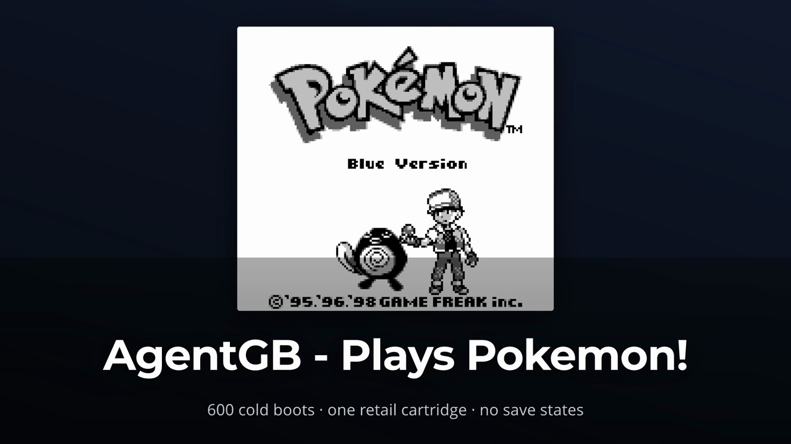
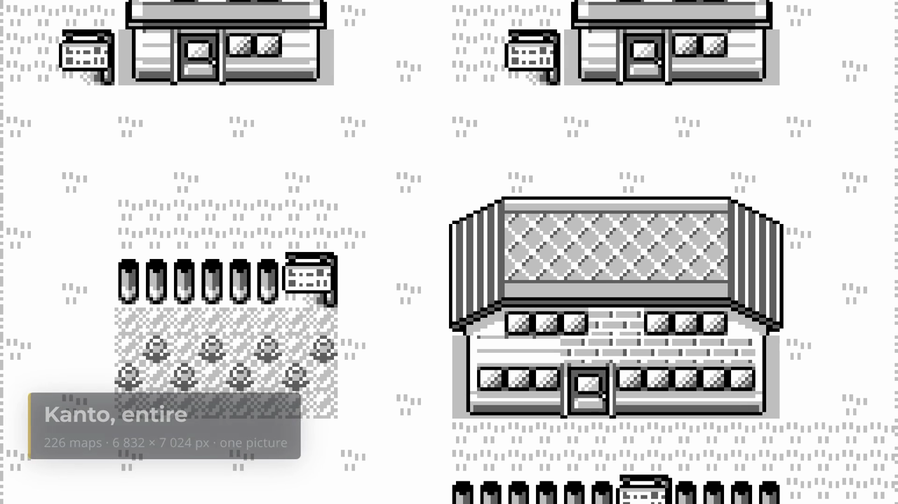
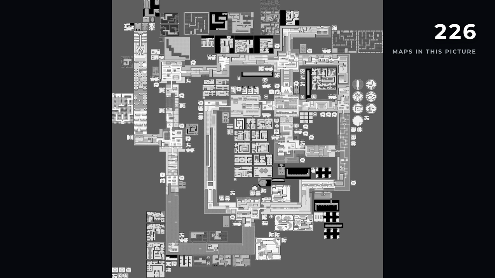
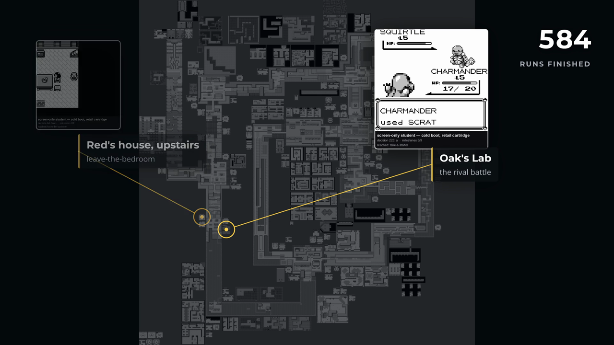
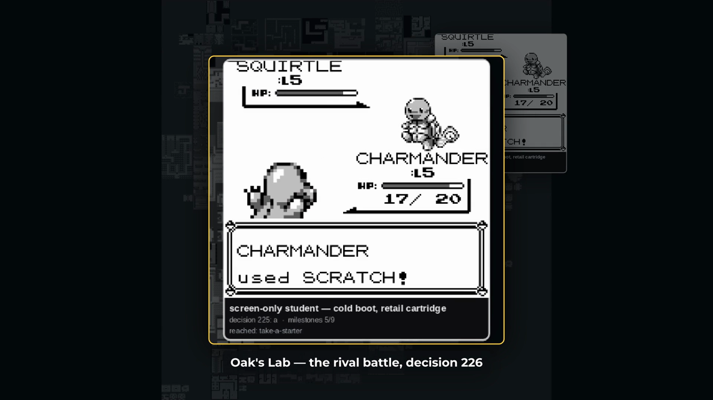
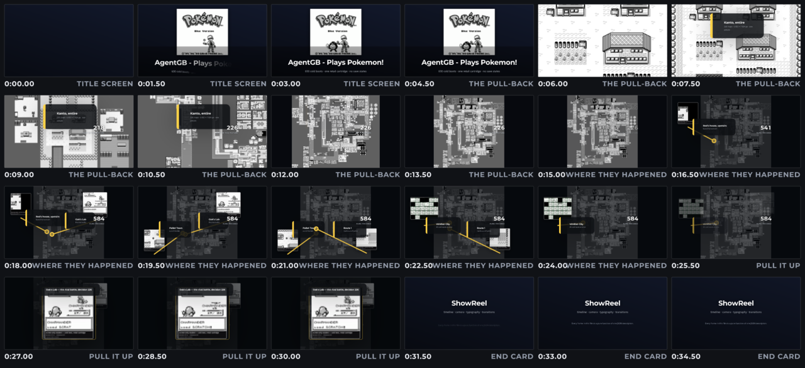

<p align="center">
  <a href="docs/brand/README.md"></a>
</p>

---

A toolset for making demo, explainer and animation films: a **timeline**, a
**camera**, **typography** and **transitions**. You describe a film — scenes,
layers, moves, words — and it renders, deterministically, to an mp4.

There is no browser and no editor. A film is a value: a Rust builder or a JSON
file, the same tree either way, so the same description can be written by hand,
generated by a program, or handed over by a tool. Same description in, same
frames out.

It knows nothing about any subject. Maps, screen captures and video clips are
*inputs*.



## Key details

|  |  |
|---|---|
| **Native Rust** | one crate. `tiny-skia` and `rustybuzz` for pixels and glyphs, `ffmpeg` to encode. No browser, no node, no headless Chromium |
| **12.0 ms a frame** | the example film, 1920×1080 at 60fps, 2082 frames in 25 s on 20 cores — [what a frame costs](docs/performance.md) |
| **48 megapixels, 4.3 ms** | the camera zooms, pans and holds over a source far larger than the frame. A 6832×7024 still renders to 1080p in 4.3 ms a frame — 33× faster than the obvious implementation |
| **Text as geometry** | glyphs are filled paths, not font-engine blits, so a title takes a gradient, an outline and a drop shadow. Real shaping, kerning, tracking in ems, **tabular figures** so a counter does not jitter as it ticks |
| **Transitions** | cut, dissolve, fade-through-colour, wipe, slide, push, iris and zoom, each composable with any easing curve or spring |
| **Overlays** | titles, lower-thirds, callouts that point at things, counters that count, and a **pull-up** that lifts a piece of the frame, dims the rest and annotates it |
| **Deterministic** | frame *n* is a pure function of the description. Two renders give byte-identical PNGs and byte-identical mp4s |
| **Delivery** | a full-quality master and the 720p/30fps mobile cut, from one command |

## Render a film

One command, from nothing to a finished mp4:

```bash
git clone https://github.com/Alchemy86/ShowReel.git && cd ShowReel && ./reel
```

`./reel` finds a Rust toolchain (offering to install one if there is none),
builds in release, and renders [`examples/showcase.rs`](examples/showcase.rs) —
a 30-second tour of the toolset that needs **no assets at all**. It draws its
own 25-megapixel poster for the camera to move over, using ShowReel's own
drawing API. Anything you pass goes straight to the CLI: `./reel sheet …`.

Needs `ffmpeg` and `ffprobe` on `PATH`.

## The worked example

[`examples/kanto_reel.rs`](examples/kanto_reel.rs) is the better film.
It builds 35 seconds entirely through the public API: a Game Boy title screen,
a pull-back over a 48-megapixel picture of all 226 Pokémon Blue maps, real run
footage bursting out at the coordinates where it was recorded, and a pull-up on
one of them.

Its pictures are extracted from a Pokémon Blue cartridge and belong to whoever
owns that cartridge, so **they are not in this repository**. The stills below
are real frames from it; [`examples/README.md`](examples/README.md) says
exactly which tool produced each asset and what the footage placements claim.

**The pull-back opens at 1:1 on the Game Boy's own 160×144 window.**



**Nine seconds later the whole of Kanto is in frame — one continuous move, no cut.**



**Footage appears at the map coordinate where it was recorded, with a line back to the place.**



**The pull-up: lift a piece of the frame, dim the rest, name it.**



## Writing a film

```rust
use showreel::prelude::*;

let film = Film::new(1920, 1080, 60.0)
    .open(
        Scene::new(5.0)
            .layer(Layer::title("AgentGB - Plays Pokemon!")
                .subtitle("600 cold boots · one retail cartridge")
                .entering(Motion::chars(0.5, 0.02))),
    )
    .then(
        Transition::fade_black(0.75),
        Scene::new(11.0)
            .layer(Layer::camera("kanto.png",
                Camera::pull_back(Framing::point(1520.0, 4560.0, 144.0), 9.6)))
            .layer(Layer::lower_third("Kanto, entire").detail("226 maps").from(1.6))
            .layer(Layer::counter(0.0, 226.0, 3.2).label("maps in this picture")),
    );
```

The same film as JSON is the same tree, so timing changes need no recompile.
A timeline is `Scene (Transition Scene)*` — a film that begins with a
transition, or has two in a row, **cannot be written down**, in Rust or in the
JSON.

## Look before you render

Rendering a film to judge its timing is the slow way round.

| | answers | on the example film |
|---|---|---|
| `showreel still --at 4.2s` | what does this moment look like? | ~100 ms |
| `showreel sheet --every 1.5s` | is the pacing right? | 3 s for all 35 seconds |
| `showreel preview --scale 0.35` | does the motion work? | 6.6 s |
| `showreel render` | the delivery | 25 s |

`sheet` puts the whole film on one page, labelled with timecodes and scene
names. It renders from a genuinely scaled-down film — type, padding, corner
radii and decode sizes all come down with the frame — so a thumbnail looks like
the film rather than the film with 1080p text pasted on it.



## Deeper

- [What a frame costs](docs/performance.md) — the measurements, and how the
  camera is fast
- [The Remotion study](docs/remotion-study.md) — what their API gets right,
  what it gets wrong, and why ShowReel is a data tree rather than a macro DSL
- [The example, in detail](examples/README.md) — the assets, and what the
  footage placements actually claim
- [Brand](docs/brand/README.md) — the mark, and how to regenerate it
- [`AGENTS.md`](AGENTS.md) — the sharp edges, for anyone working on it

## Licence

[PolyForm Noncommercial 1.0.0](LICENSE). Personal and noncommercial use is
free; commercial use needs permission first.
