<p align="center">
  <a href="docs/brand/README.md"></a>
</p>

---

A toolset for making demo, explainer and animation films: a **timeline**, a
**camera**, **typography** and **transitions**. You describe a film — scenes,
layers, moves, words — and it renders, deterministically, to an mp4.

A film is a value: a Rust builder or a JSON file, the same tree either way, so
the same description can be written by hand, generated by a program, or handed
over by a tool. Same description in, same frames out — deterministically,
whether that render happens on the command line or [in a browser tab with no
server at all](#in-the-browser).

It knows nothing about any subject. Maps, screen captures and video clips are
*inputs*.

**▶ Watch the reel** — [`docs/showreel-reel.mp4`](docs/showreel-reel.mp4)
(52 s, [mobile cut](docs/showreel-reel.mobile.mp4)): ShowReel's own demo,
made with ShowReel. The camera over a 57-megapixel still and a live clip, the
parallax depth push, a colour grade shown ungraded-then-graded, kinetic text,
callouts and a mixed soundtrack — all authored as one film file,
[`examples/showreel_demo.film.jsonc`](examples/showreel_demo.film.jsonc)
(readable, commented, and [`examples/showreel_demo.assets.md`](examples/showreel_demo.assets.md)
says where every asset came from).


## The gallery — one capability, one GIF, one film file

A claim nobody can see isn't much of a claim. Each GIF below is a short film
that shows exactly **one** thing; each is a committed, runnable film file, so
the picture and the how-to are the same artefact. They are generated by
[`examples/gallery.rs`](examples/gallery.rs) and rendered by the new
[`showreel gif`](#gif-export) with [`examples/gallery/render.sh`](examples/gallery/render.sh)
— every still they draw is procedural, so a clean clone reproduces all of them
with nothing else on disk. Where a study claimed the capability, the link points
back at the claim.

| | |
|---|---|
| 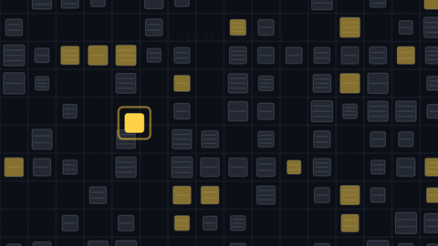<br>**Camera push** — zoom and pan over a still far larger than the frame. [film](examples/gallery/camera.film.jsonc) · [claim](docs/anarchist-study.md#2-punch-ins-and-camera-pushes-over-stills-and-clips-timed-to-narration--showreel-already-does-this) | 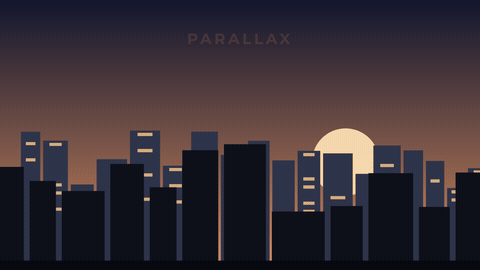<br>**Parallax** — one flat image, three depth planes, one camera move. [film](examples/gallery/parallax.film.jsonc) · [claim](docs/anarchist-study.md#1-fake-depth-parallax-animation-of-a-flat-still--showreel-could-nearly-do-this) |
| <br>**Colour grade** — the same scene, ungraded then `Grade::documentary()`. [film](examples/gallery/grade.film.jsonc) · [claim](docs/anarchist-study.md#7-colour-grade-desaturated-contrast-pushed-documentary-look--showreel-cannot-do-this) | <br>**Animated chart** — a plotted function drawing itself in. [film](examples/gallery/chart.film.jsonc) · [claim](docs/tvjunkie-study.md#the-cheapest-wins-near-the-counter-and-chart-work) |
| <br>**Counter** — a bankroll ticking up, tabular figures, grouped thousands. [film](examples/gallery/counter.film.jsonc) · [claim](docs/tvjunkie-study.md#1-the-bankroll-counter-both-plausible-forms--showreel-already-does-this) | <br>**Kinetic captions** — words landing one at a time with a spring. [film](examples/gallery/captions.film.jsonc) · [claim](docs/anarchist-study.md#3-kinetic-captionkeyword-pop-ins-synced-to-narration--showreel-already-does-this) |
| <br>**Transitions** — a cross-blur dissolve, then a wipe. [film](examples/gallery/transitions.film.jsonc) · [claim](docs/remotion-study.md#what-showreel-does-with-all-of-this) | 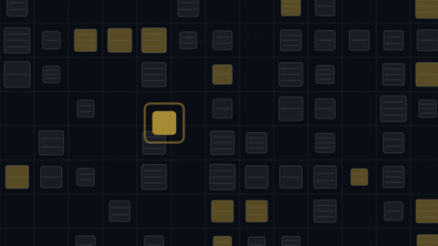<br>**Callouts** — a ring on a target, a leader line, a label. [film](examples/gallery/callouts.film.jsonc) · [claim](docs/anarchist-study.md#4-calloutannotation-graphics-over-evidence--showreel-already-does-this) |

Two studies described capabilities they didn't think were there yet: the
anarchist study called the **parallax** shot something ShowReel "could *nearly*
do" and the **colour grade** something it "cannot do" — both were built in the
rounds since, and the two GIFs above are the proof those verdicts are now stale.
Everything else was claimed as already-working and holds up on screen.

## Key details

|  |  |
|---|---|
| **Native Rust** | one crate. `tiny-skia` and `rustybuzz` for pixels and glyphs, `ffmpeg` to encode. No browser, no node, no headless Chromium |
| **12.0 ms a frame** | the example film, 1920×1080 at 60fps, 2082 frames in 25 s on 20 cores — [what a frame costs](docs/performance.md) |
| **48 megapixels, 4.3 ms** | the camera zooms, pans and holds over a source far larger than the frame. A 6832×7024 still renders to 1080p in 4.3 ms a frame — 33× faster than the obvious implementation |
| **Text as geometry** | glyphs are filled paths, not font-engine blits, so a title takes a gradient, an outline and a drop shadow. Real shaping, kerning, tracking in ems, **tabular figures** so a counter does not jitter as it ticks |
| **Transitions** | cut, dissolve, fade-through-colour, wipe, slide, push, iris, zoom and a cross-blur dissolve, each composable with any easing curve or spring |
| **Overlays** | titles, lower-thirds, callouts that point at things, counters that count, a **pull-up** that lifts a piece of the frame, dims the rest and annotates it, and a progress bar that fills like a counter but draws no digits |
| **Sound** | any audio file, placed and trimmed on the film's clock like a clip, with fades in and out, gain, and several tracks mixed. It reaches the master **and** the mobile cut. A video clip's own soundtrack joins the mix too, with the same gain, fades and a mute. A track can also be **generated music** — a chiptune synthesised to the film's own length, tempo-fit so a beat lands on the cut — see [below](#generated-music-timed-to-the-film) |
| **Deterministic** | frame *n* is a pure function of the description. Two renders give byte-identical PNGs and byte-identical mp4s |
| **Delivery** | a full-quality master and the 720p/30fps mobile cut, from one command — plus a palette-optimised, README-sized **GIF** of any window of the film, from another ([`showreel gif`](#gif-export)) |
| **A studio** | `showreel studio film.json` — a scrubber, live reload and the film's structure in a browser, behind an opt-in feature so the plain render path stays as light as it was |
| **A colour grade** | a post-composite lift/contrast/saturation/vignette pass, `"documentary"` in one word or five raw knobs, over a still, a clip or a parallax stack alike — see [below](#a-colour-grade) |
| **Animated charts** | a plotted function or line, or bars that grow, on deliberate axes — drawn in over the film's own clock, with data written inline **or read from a CSV/JSON file** — see [below](#an-animated-chart) |
| **Plugins** | a new layer kind defined as data — a parameterised template that expands into existing layers, works native and in the browser alike — see [below](#plugins--a-new-layer-kind-without-a-fork) |

## Everything that's here

A feature list, not a pitch — every line below is something a test or a
render exercises today, not a plan. Organised by what it's for rather than
which module it lives in.

**Describing a film**
- A timeline of `Scene`s joined by `Transition`s — `Scene (Transition Scene)*`,
  a shape that makes "transition first" or "two transitions in a row"
  unwritable rather than a runtime error (`src/timeline.rs`)
- 14 built-in layer content kinds: solid fill, linear gradient, edge scrim, still
  image, video clip, plain text, title (+ subtitle), lower-third (+ detail),
  counter, callout, pull-up, the fake-depth parallax stack, a progress bar, and an
  animated chart (`src/layer.rs`, `src/chart.rs`) — plus a fifteenth, `custom`,
  that dispatches to a **plugin** (a new kind defined as data, `src/plugin.rs`)
- Charts read their series inline **or from an external CSV/JSON file**, resolved
  like any asset and validated loudly at load (`src/chart.rs`, `src/assets/data.rs`)
- 9 transition presentations — cut, dissolve, fade-through-colour, wipe,
  slide, push, iris, zoom-in, cross-blur — each independent of how it's
  *paced*: any easing curve or a physical spring (`src/transition.rs`, `src/ease.rs`)
- 8 entrance motions — fade, rise, drop, slide-in, scale, and per-character or
  per-word staggered pop-ins, plus none (`src/motion.rs`)
- A camera: keyframed pan/zoom over a mip-backed still (geometric zoom
  interpolation, so a 48-megapixel source renders to 1080p in single-digit
  milliseconds — [what a frame costs](docs/performance.md)) or over a
  decoded clip frame (`src/camera.rs`)
- A colour grade: a named look or five raw knobs, once per scene, over
  everything already drawn — the newest capability, see
  [below](#a-colour-grade) (`src/grade.rs`)
- JSON film files with a deliberately narrow JSONC allowance — `//`/`/* */`
  comments and trailing commas, nothing else — so a plain `.json` still loads
  unchanged (`src/timeline.rs`)
- A Rust builder API that produces the exact same tree as the JSON — write a
  film by hand, generate one from a program, or load one from disk, with no
  special case for any of the three (`src/prelude.rs`)

**Sound**
- Film-level audio tracks: placed and trimmed on the film's own clock, with
  independent fade-in/fade-out and gain, several tracks mixed without
  quietly rescaling anyone's volume (`src/audio.rs`)
- A clip's own baked-in soundtrack joins the mix automatically — gain, fades
  and a mute, all without a separate `Audio` entry (`src/audio.rs`, `src/layer.rs`)
- **Generated music**: a chiptune synthesised from a one-line description,
  deterministic and sized to the film — tempo-fit so a beat lands on the cut,
  with no bed to license (`src/music.rs`)
- **Directed narration**: a voice-over script the film owns, marked up line by
  line for pace and pause, spoken by a voice model and baked ahead of time so
  `render` needs no Python — with real per-word timings for cueing and captions
  (`src/narration.rs`, `src/narrate.rs`)
- Both the full-quality master and the 720p/30fps mobile cut carry audio —
  checked by an ffprobe-driven test, not assumed (`tests/render_pipeline.rs`)

**Delivery**
- `showreel render` — full master plus the mobile cut, from one command
  (`src/encode.rs`). The whole-film render is segmented and resumable: a
  killed render (a crash, a `Ctrl-C`) leaves finished chunks on disk, and a
  rerun with the same film/assets/settings picks up where it left off
  instead of starting over (`src/segments.rs`, `docs/segmented-rendering.md`)
- `showreel gif` — a window of the film as a palette-optimised, README-sized
  looping GIF, its 256 colours generated from the footage rather than a fixed
  web palette (`src/encode.rs`, [GIF export](#gif-export))
- `showreel still` / `sheet` / `preview` — a single frame, a labelled contact
  sheet of the whole film, or a fast low-resolution pass, all far cheaper
  than a full render (`src/preview.rs`)
- Deterministic rendering, parallelised across every core when the
  `parallel` feature is on, one frame at a time otherwise (`src/render.rs`)
- `showreel new` — a small, working, commented starter film, so the first
  render needs no schema lookup

**The studio and its API** (`--features studio`)
- `showreel studio` — a scrubber, live reload on file save, the film's
  structure, and parse/validation errors shown in the page itself
  (`src/studio.rs`)
- A local HTTP API riding that same running studio: `/api/info`,
  `/api/check`, `/api/still`, `/api/render` — see [below](#api-access)

**MCP** (`--features mcp`)
- `showreel mcp` — five tools (`new_film`, `check_film`, `film_info`,
  `render_still`, `render_film`) over the official `rmcp` SDK, proven against
  a real stdio JSON-RPC round trip, not just the tool functions in isolation
  (`src/mcp.rs`, `tests/mcp_server.rs`) — see [below](#mcp-support)

**In the browser** (`--features wasm`)
- The renderer itself compiles to `wasm32-unknown-unknown` — no server, no
  plugin (`src/wasm.rs`)
- A real editor, not just a scrubber: add a clip or a still, set a trim, pick
  a transition, retype text, reorder scenes, drag a layer/clip trim/callout
  directly on the preview, save the film back out as JSON
  (`tools/web/editor.js`, `tools/web/geometry.js`)
- A dropped video clip decodes client-side with no ffmpeg, via a seeked
  `<video>` element (`tools/web/clipimport.js`)
- Real audio in the browser preview, via a second Web Audio graph the wasm
  renderer itself knows nothing about (`tools/web/audio.js`)
- Export to a real `.webm`: WebCodecs `VideoEncoder` plus a hand-rolled muxer
  verified against `ffprobe` (`tools/web/muxer.js`, `tools/web/export.js`)
- Thumbnails for every asset (scaled-decode for a still, a byte-slice out of
  a clip's own container for a clip — no extra decode) (`tools/web/thumbnails.js`)
- `showreel web-pack` packages a film plus its assets (clips pre-decoded by
  ffmpeg, natively, ahead of time) into a directory any static host can serve

## Getting started

**Prerequisites**

- A Rust toolchain — the crate uses the 2024 edition, so a recent stable
  compiler. If you don't have one:
  ```bash
  curl --proto '=https' --tlsv1.2 -sSf https://sh.rustup.rs | sh
  ```
- `ffmpeg` and `ffprobe` on `PATH` — needed for `showreel render`/`preview`
  and for pre-decoding clips for the browser build. Not needed for
  `showreel still`/`sheet`/`check`/`info`, which never touch ffmpeg.
  (`apt install ffmpeg`, `brew install ffmpeg`, or your platform's equivalent)

**The fastest way to something rendered**, from nothing:

```bash
git clone https://github.com/Alchemy86/ShowReel.git && cd ShowReel && ./reel
```

`./reel` finds a Rust toolchain (offering to install one if there is none),
builds in release, and renders [`examples/showcase.rs`](examples/showcase.rs) —
a 30-second tour of the toolset that needs **no assets at all**. It draws its
own 25-megapixel poster for the camera to move over, using ShowReel's own
drawing API. Anything you pass goes straight to the CLI: `./reel sheet …`.

**Building the CLI yourself**, and starting a film from a blank page:

```bash
cargo build --release --features cli --bin showreel
./target/release/showreel new film.jsonc --title "My Demo"
./target/release/showreel still film.jsonc --at 2s -o still.png   # milliseconds
./target/release/showreel render film.jsonc -o film.mp4           # the real encode
```

`cli` is a Cargo feature, not the default — a library consumer who only wants
`showreel` as a dependency doesn't pay for `clap`. `render`/`preview`/`web-pack`
need `ffmpeg`/`ffprobe` on `PATH`; `still`/`sheet`/`new`/`check`/`info`/`fonts`
don't touch it at all. Add `--features parallel` to spread a full render
across every core (`rayon`) — without it, frames render one at a time, which
is still fine for `still`/`sheet` and for trying things out.

**The browser build** needs one extra Rust target, once:

```bash
rustup target add wasm32-unknown-unknown
./build-wasm.sh                                             # -> tools/web/showreel.wasm
cargo build --release --features wasm --bin showreel
./target/release/showreel web-pack film.jsonc -o dist        # needs ffmpeg for any clips
python3 -m http.server -d dist                               # or any static file host
```

Open the printed URL and you have the same scrubbable, editable studio as
`showreel studio`, with no server needed once `dist/` is built — see
["In the browser"](#in-the-browser) for what it can and can't do.

## The worked example

[`examples/kanto_reel.rs`](examples/kanto_reel.rs) is the better film.
It builds 35 seconds entirely through the public API: a Game Boy title screen,
a pull-back over a 48-megapixel picture of all 226 Pokémon Blue maps, real run
footage bursting out at the coordinates where it was recorded, and a pull-up on
one of them.

Its pictures are extracted from a Pokémon Blue cartridge and belong to whoever
owns that cartridge, so **they are not in this repository**. The stills below
are real frames from it; [`examples/README.md`](examples/README.md) says
exactly which tool produced each asset and what the footage placements claim.

**The pull-back opens at 1:1 on the Game Boy's own 160×144 window.**


**Nine seconds later the whole of Kanto is in frame — one continuous move, no cut.**


**Footage appears at the map coordinate where it was recorded, with a line back to the place.**


**The pull-up: lift a piece of the frame, dim the rest, name it.**


## Writing a film

```rust
use showreel::prelude::*;

let film = Film::new(1920, 1080, 60.0)
    .open(
        Scene::new(5.0)
            .layer(Layer::title("AgentGB - Plays Pokemon!")
                .subtitle("600 cold boots · one retail cartridge")
                .entering(Motion::chars(0.5, 0.02))),
    )
    .then(
        Transition::fade_black(0.75),
        Scene::new(11.0)
            .layer(Layer::camera("kanto.png",
                Camera::pull_back(Framing::point(1520.0, 4560.0, 144.0), 9.6)))
            .layer(Layer::lower_third("Kanto, entire").detail("226 maps").from(1.6))
            .layer(Layer::counter(0.0, 226.0, 3.2).label("maps in this picture")),
    );
```

The same film as JSON is the same tree, so timing changes need no recompile.
A timeline is `Scene (Transition Scene)*` — a film that begins with a
transition, or has two in a row, **cannot be written down**, in Rust or in the
JSON.

**You do not have to write Rust at all.** A film *is* a JSON document, and
[`examples/kanto.film.jsonc`](examples/kanto.film.jsonc) is a complete one,
committed and ready to render — open it, edit a duration, render it. Comments
are welcome: film files accept the JSONC subset of JSON — `//` and `/* */`
comments, plus a trailing comma on the last element of a list — which is why
that one's extension is `.jsonc` rather than `.json`. A plain `.json` file
with no comments in it still loads exactly as before.

```bash
showreel render examples/kanto.film.jsonc -A <assets> -o reel.mp4
```

Starting from a blank page is the slow way in — `showreel new` writes a small,
working, commented film that needs no assets at all, so the first render is
one command away rather than a schema lookup:

```bash
showreel new film.jsonc --title "My Demo"
showreel still film.jsonc --at 2s -o still.png   # or render it straight away
```

### Sound

A track hangs off the film rather than a scene, because a theme that carries an
opening and settles under the next shot belongs to neither of them:

```rust
let film = film
    // Carries the opening, then recedes.
    .sound(Audio::track("theme.wav").lasting(8.2).fades(0.35, 3.2))
    // The same performance underneath, quieter, to the end of the film.
    .sound(Audio::track("theme.wav").at(5.0).from(5.0).fades(3.2, 3.5).gain(0.2));
```

`at` is where it lands on the film's clock and `from` is where to start reading
inside the source — the two are easy to confuse and are deliberately different
words. An unset duration means "to the end of the film". Tracks are mixed
without ffmpeg quietly rescaling anyone's volume, and the mobile cut carries the
audio too.

### Generated music, timed to the film

A track's source can be a *generated* chiptune instead of a file — synthesised
from a one-line description, so a film with a soundtrack stays a single readable
text you can commit and rebuild from source, with no bed to license:

```jsonc
"audio": [
  { "music": "funk" },                                    // the reference tune, sized to the film
  { "music": { "mood": "dreamy", "key": "C", "bpm": 96 }, "fade_out": 2.0 }
]
```

```rust
film.sound(Audio::music(Music::chiptune().fit(MusicFit::Film)).fade_out(2.0))
```

Written as a bare mood word — the same `"documentary"`-style shorthand the
colour grade uses — or an object for the `key`, `bpm` and tempo `fit`. It is one
idiom done well, the NES/SID chiptune (a pulse bass, a pulse-wave arpeggio lead,
noise-burst drums), not a general synthesiser: a `mood` selects a chord
progression and step patterns, not a new instrument. It is otherwise an ordinary
track — the `at`/`gain`/fades/mixing and the mobile cut all apply, because a
generated track becomes a WAV and from there is just an audio input like any
file.

**The timing is the point.** With no explicit `duration` the tune is synthesised
to exactly the film's length, so it never needs trimming. `"fit": "film"` goes
further: the authored `bpm` becomes a *target*, nudged so a whole number of bars
spans the film — the last downbeat lands on the final frame, and the bar grid is
regular against the film, so scene cuts spaced a whole number of bars apart get a
chord change on every cut. `examples/music_demo.film.jsonc` proves it: four
bar-aligned scenes at 128 BPM, and its three hard cuts land within ~7 ms of a
downbeat in the rendered audio (rebuild it with `showreel render
examples/music_demo.film.jsonc -o docs/music-demo.mp4` — no assets needed).

The generator is deterministic (a seeded PRNG, so renders are reproducible,
unlike the `numpy`-global-RNG script it grew from) and the DSP is pure Rust, so
it compiles to wasm; in the browser, `showreel web-pack` pre-synthesises the WAV
and ships it as a snapshot the Web Audio preview plays (editing a music track's
mood/key/bpm needs a repackage to be heard, the same as a clip's own audio). The
general "align to N arbitrary interior cut times" solver is a documented next
step, not a half-built one — see `src/music.rs`.

### Narration, directed

A track's source can also be *narration* — a script a voice model speaks. Like
music it hangs off the film alongside the other tracks, but the script is
written into the film and marked up **line by line**, the way you would direct a
voice actor:

```jsonc
"audio": [
  {
    "narration": {
      "engine": "kokoro",           // which synthesiser (a seam — see below)
      "voice": "bm_george",         // interpreted by the engine; here a British male read
      "gap": 0.45,                  // default beat after a line
      "lines": [
        { "text": "Everything you are about to see is built from a single number.",
          "pace": 0.95, "pause_after": 0.7 },   // a shade slower, hold a beat
        { "text": "No artist drew this city, and nobody decided where the street lamps go.",
          "pace": 1.0 },
        { "text": "Change the number, and the whole city changes with it.",
          "pace": 0.92 }            // slow, to land the point
      ]
    },
    "at": 1.4
  }
]
```

Or the terse forms — `"narration": "One line."`, or `"narration": ["First.",
"Second."]` — the same bare-word-or-object shorthand music and the colour grade
use. **`pace`** is the synthesiser's speed for that one line, and **`pause_before`
/ `pause_after`** are silence around it. One flat speed across a whole script is
exactly what sounds generated; per-line direction is what makes it sound
*directed*, and it is the single biggest lever after the voice itself. From `at`
on it is an ordinary track — gain, fades, mixing and the mobile cut all apply,
because narration becomes a WAV and from there is just an audio input.

**Bake it once, then render needs no Python.** This is the one thing that works
differently from music. Music is pure Rust and synthesises on every render;
a voice model is a heavy Python stack, so narration is *baked ahead of time*
into a plain WAV asset beside the film — the same shape as `web-pack`
pre-decoding a clip:

```
showreel narrate examples/narration_demo.film.jsonc -A examples/narration_demo -o examples/narration_demo
showreel render  examples/narration_demo.film.jsonc -A examples/narration_demo -o docs/narration-demo.mp4
```

`narrate` runs the model, **verifies the audio is speech and not noise** (a
neural vocoder can emit plausible-looking white noise that passes every codec
check — the zero-crossing gate catches it), and writes a content-addressed WAV
plus a **word-timing manifest**. `render` then only mixes that WAV with ffmpeg —
no Python, no model. The WAV is named by a hash of the script, so editing a line
makes the old bake un-findable and `render` says so, naming the fix, rather than
quietly using a stale take. Committing the baked WAV (it is small) means anyone
who clones the repo can render the audio with no voice model at all — narration
as a first-class, pre-rendered asset.

**Word timings are real.** The model predicts a duration for every word, so the
manifest beside the WAV carries a genuine start/end for each word (not a
characters-per-second guess). That is what lets narration be cued against what
is on screen — in `examples/narration_demo.film.jsonc` the lower-third captions'
`from`/`duration` come straight out of the manifest — and is the groundwork for
captions.

**The synthesiser is a seam, not the design.** `engine` and `voice` are both
declared in the film. Kokoro (voice `bm_george`) is the one engine implemented,
but it sits behind a `SynthEngine` trait and an engine registry: a different
model — a voice-cloning engine, say — is a new entry there and a one-word change
in the film, with nothing in the format to unpick.

**What a stranger who clones the repo needs.** To *render* a film whose
narration is already baked (like the committed demo): nothing but ffmpeg. To
*bake their own* narration, they need a Python environment with Kokoro
installed; `tools/narrate/README.md` has the exact setup, and `showreel narrate
--python <path>` (or `$SHOWREEL_KOKORO_PYTHON`) points at it. This is a real
dependency, honestly: narration is the one ShowReel feature whose *authoring*
needs a stack behind the terminal — but its *use* does not, which is the whole
reason it bakes to an asset. `examples/narration_demo.film.jsonc` is the proof
film: the ASCII-city pitch read over that engine's footage, the chiptune ducked
underneath, rendered to `docs/narration-demo.mp4`.

### A clip's own audio

`Content::Clip` draws a decoded video frame, and by default its source file's
own soundtrack joins the mix too — no separate `Audio` track to place, since
its position and length are the clip's own:

```rust
Layer::clip("burst.mp4").trim(8.0, 3.4)         // plays at full level
Layer::clip("burst.mp4").trim(8.0, 3.4).mute()  // draws, contributes no sound
Layer::clip("burst.mp4").trim(8.0, 3.4).clip_gain(0.3)        // ducked
Layer::clip("burst.mp4").trim(8.0, 3.4).clip_fades(0.2, 0.5)  // in and out
```

Measured on a 3s test clip (320×180, a synthesised tone under a test pattern),
rendered through `showreel render` exactly as any film is:

| clip audio | master's audio stream | measured level |
|---|---|---|
| default (gain 1.0) | `aac` | −24.1 dB mean |
| `.clip_gain(0.3)` | `aac`, 10.5 dB quieter | −34.6 dB mean (≈ 20·log₁₀(0.3), as it should) |
| `.mute()` | none | — |

This does not loop a clip's audio to match `ClipLoop::Loop` — a looping
*picture* has no natural audio analogue, so the sound simply runs out when the
decoded source does, the same way a video frozen on its last frame does not
keep making noise. See `AGENTS.md` for the full reasoning.

### A clip's own speed

`Layer::clip(...).speed(2.0)` plays the decoded window at a different rate —
double speed reaches a highlight sooner, `0.5` is real slow motion:

```rust
Layer::clip("burst.mp4").trim(0.0, 6.0)              // plays at 1x
Layer::clip("burst.mp4").trim(0.0, 6.0).speed(3.0)   // the same window, 3x through
```

Same on-screen moment — one second into the layer — two different points in
the source, because speed only changes *which decoded frame* is picked:

| `speed(1.0)` (default) | `speed(3.0)` |
|---|---|
|  | 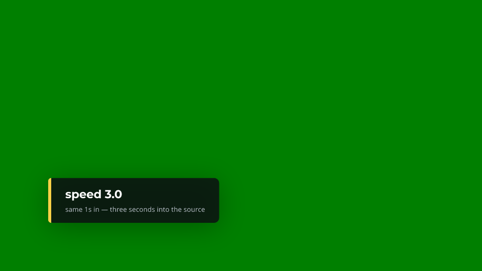 |

It does not touch the clip's own soundtrack. Playing audio at a different rate
needs pitch/tempo correction ffmpeg can do (`atempo`) but this crate does not
attempt, so — the same call as `ClipLoop::Loop`'s audio above — a clip's own
audio is silently dropped from the mix while `speed != 1.0`, rather than
played back out of sync with what is on screen. Add a separate `Audio` track
if the moment needs sound.

### A cross-blur dissolve

`Presentation::CrossBlur` softens both frames toward the transition's
midpoint and sharpens back out, rather than staying crisp throughout like a
plain dissolve — it reads as a more "cinematic" cut:

```rust
Transition::cross_blur(1.2)  // radius defaults to 24px, peaking at the midpoint
```

Same cut, same midpoint, both stills real frames from `showreel still`:

| plain dissolve | cross-blur |
|---|---|
| 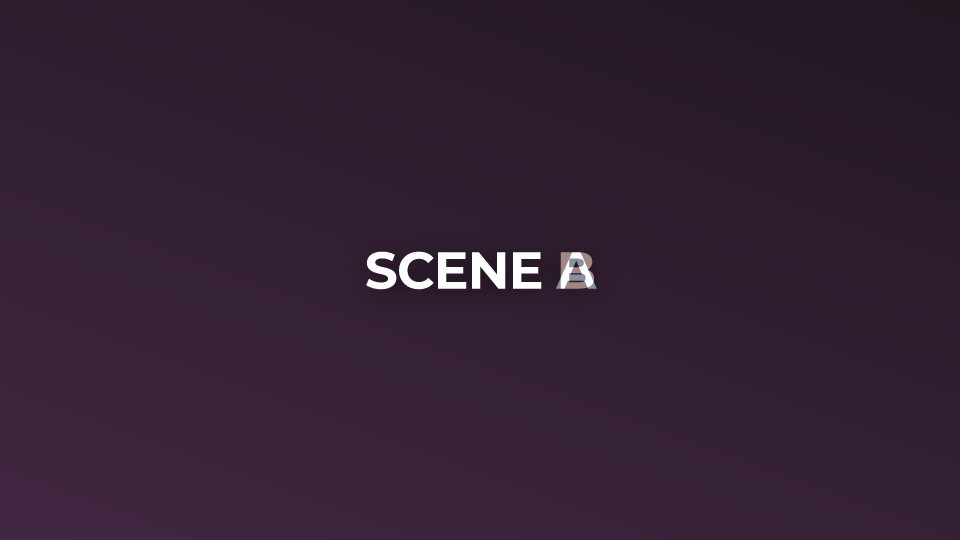 |  |

**The cost is real and worth knowing before reaching for it.** Blurring every
channel of a full frame (`canvas::blur_rgba`) measured at **~170ms per call**
at 1920×1080 — independent of the blur radius, since a box blur's cost is the
frame's pixel count, not the window size. `CrossBlur` calls it twice a frame
(outgoing and incoming), so a transition at that resolution costs on the order
of a third of a second a frame on top of everything else drawn — against the
whole example film's own 12ms/frame average. A short transition (well under a
second) keeps that bounded to a few seconds of extra render time; a film-length
one would not.

### A progress bar

A generic decorative shape — a track and a fill that animates the same way
`Counter` does, but draws no digits:

```rust
Layer::bar(0.0, 1.0, 2.0)   // fills over 2 seconds
    .bar_track(Color::rgba(255, 255, 255, 40))
    .bar_fill(Color::rgb(255, 209, 71))
    .frac(0.2, 0.56, 0.6, 0.045)   // sized like Solid/Gradient: you place it
```

Real frame, `showreel still`, 1.2s into a 2s linear fill:

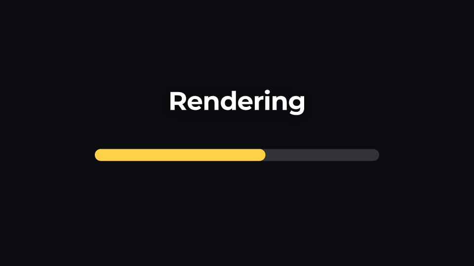

Corners default to a pill (half the bar's own height) and clamp gracefully
when the filled portion is narrower than the radius, the same
`round_rect_path` clamp every other rounded shape in ShowReel already uses.
`Layer::bar_fixed(v)` holds at a constant level with no animation at all —
useful for a static indicator rather than a fill.

### An animated chart

`Content::Chart` is data that arrives over time: a plotted function or line, or
bars that grow, on axes that look deliberate. Like every other layer it is
pure data — series, axes and a reveal — so it can be written in Rust, loaded
from JSON, or emitted by a tool over MCP. Nothing in the crate knows what the
numbers *are*; a growth curve, a poll and a benchmark are all the same layer.

The one animation is a **reveal sweep**: a single eased 0..1 that crosses the
plot left to right on the film's own clock, the same way `Counter` and the
progress bar ease a value over `over` seconds. A line is drawn only up to the
swept x (its leading segment interpolated, so the tip advances smoothly rather
than a point at a time); bars pop in as the sweep passes their slot.

A function, sampled over its x-range and drawn in over 3 seconds — the
treatment of the reference short this feature was built from:

```rust
Layer::chart_function("40*log(x+1)", 0.0, 80.0)   // ln, sampled across [0, 80]
    .chart_axes("age (years)", "how fast a year feels")
    .chart_marker(Marker::VLine { x: 40.0, colour: Some(green), label: Some("midpoint".into()), width: 3.0 })
    .drawing_in(3.0)
    .frac(0.10, 0.26, 0.82, 0.60)   // sized like a bar: you place it
```

The expression grammar (`src/expr.rs`) is deliberately small — the four
operators plus `^`, one variable `x`, `sin`/`cos`/`exp`/`log`/`sqrt`/… and the
constants `pi`/`tau`/`e`. A malformed expression, or a function chart with no
x-range, is a `validate()` error caught by `showreel check`, not a silent
blank. An explicit line takes points instead:
`Series::Line { points: vec![[0.0, 0.0], [1.0, 3.0], …], .. }`.

Bars grow to their values, and several series cluster into groups:

```rust
Layer::chart(vec![
    Series::Bars { values: vec![32.0, 48.0, 61.0, 74.0], labels: vec!["Q1".into(), "Q2".into(), "Q3".into(), "Q4".into()], paint: Some(cyan.into()), name: Some("2023".into()) },
    Series::Bars { values: vec![40.0, 55.0, 70.0, 92.0], labels: vec![],           paint: Some(magenta.into()), name: Some("2024".into()) },
])
.chart_axes("quarter", "revenue (£k)")
.drawing_in(2.8)
```

Three moments of the worked example (`examples/chart_demo.rs`, which needs
nothing on disk — `cargo run --release --example chart_demo`, then `showreel
render examples/chart.film.jsonc -o out/chart_demo.mp4`):

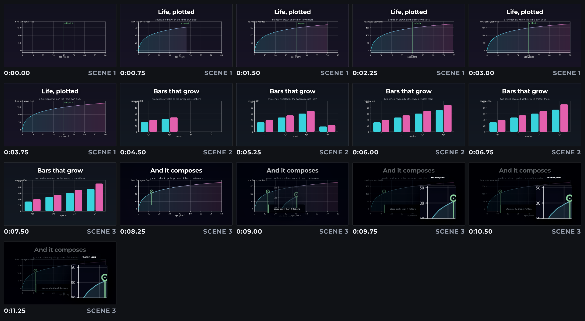

**It composes with the rest of the crate without knowing it does.** The third
scene above is the same curve with a `Grade` over it (a post-composite pass on
the finished pixels), a `Callout` pointing into it, and a `PullUp` enlarging a
corner of it — none of them chart-aware, because the grade lands on pixels, a
callout is just another layer with a higher `z`, and a pull-up lifts a region
of *whatever* is beneath it. The showreel `Camera` is a still/clip feature
over a mip pyramid, so "push in on a chart" is `PullUp` (a bitmap lift of the
drawn region), not a camera bolted onto procedural drawing.

**The cost is a single ordinary draw, not an expensive one.** Measured
in-process (release, single-threaded), a full animated function chart at
1920×1080 — a 240-sample gradient-stroked curve, filled underneath, with axes,
ticks, a marker and per-frame tick-label layout — added **~9ms/frame** over the
same scene without it. That is below the colour grade's ~34–40ms and far below
`CrossBlur`'s ~170ms; bars are cheaper still. Comfortably real-time.

Audio mapped to the curve — the reference short also plays each function as a
sound — is a separate feature, deliberately not started here.

#### Reading a chart's data from a file

Nobody hand-types a series they already have in a file. A chart series can name
an external **CSV or JSON**, referenced by path exactly the way an image or clip
is — resolved through the same `-A/--assets` roots, decoded once and cached:

```jsonc
{ "kind": "data", "file": "adoption.csv", "x": "week", "y": "active_users", "fill": true }
```

The film still says *what* it plots without opening the data: `x`/`y` name the
columns. With `"bars": true` the `x` column supplies category labels and the
chart is a bar chart:

```jsonc
{ "kind": "data", "file": "regions.json", "x": "region", "y": "revenue", "bars": true }
```

Two formats are read (chosen by extension): CSV with a header row, and JSON as
either an array of row objects (`[{"week":0,"active_users":50}, …]`) or an
object of columns (`{"week":[0,1], "active_users":[50,140]}`).

**The failure mode is the point.** A missing file, a missing column, or a cell
that will not parse is a **loud error at load — naming the file and the row** —
never a silently empty or wrong chart:

```
$ showreel check film.jsonc -A examples
error: scene 2 layer 2 (chart)
  chart series 0: data file examples/adoption.csv: column "active_users" row 7 is "n/a", which is not a number
```

`showreel check`/`info`/`render`/`still`/`sheet` all surface it (the render path
also warms the cache in `preload`, so the parse is paid once). The worked proof
lives at `examples/data_plugin_demo.film.jsonc` (+ its `data_plugin_demo/`
files); render it with `showreel render examples/data_plugin_demo.film.jsonc -A
examples`. In the browser the data is not yet registered (there is no
filesystem) — `web-pack` ships the file but a wasm chart reading it is a known
gap, the same shape as a clip needing pre-decoding.

### Plugins — a new layer kind without a fork

ShowReel's layer kinds are a closed set, on purpose: a layer is **data**, not a
component, which is what lets one film be written in Rust, loaded from JSON, or
emitted over MCP with none of them a special case. A plugin adds a fourteenth
kind *without breaking that* — because **a plugin is also data**: a named,
parameterised template that expands into the layers the crate already draws.

A plugin is a small JSON file (or an inline block). This defines a `stat-card`
kind — a panel, an accent strip, a counter and a caption — parameterised by
value, label and colour (`examples/stat_card.plugin.json` is the full version):

```jsonc
{ "name": "stat-card",
  "params": [ { "name": "value" }, { "name": "label" }, { "name": "accent", "default": "#4ad8dc" } ],
  "body": [
    { "type": "counter", "count": { "from": 0, "to": "{{value}}", "over": 1.4 }, "label": "{{label}}" }
  ] }
```

A film brings it into scope and uses it like any layer:

```jsonc
{ "width": 1920, "height": 1080, "fps": 30,
  "plugins": [ { "file": "stat_card.plugin.json" } ],
  "opening": { "duration": 4.0, "layers": [
    { "type": "custom", "use": "stat-card",
      "with": { "value": 5100, "label": "Active users", "accent": "#4ad8dc" } }
  ] } }
```

`{{param}}` placeholders substitute at load; a **whole-string** placeholder keeps
its value's type, so `"{{value}}"` lands in a numeric field as the number
`5100`, not `"5100"`. The `custom` layer's own `from`/`z`/`opacity` shift the
whole widget, so you place or restack it without editing the plugin. A missing
required parameter, a typo'd one, an unknown plugin, or a body that will not
deserialise all fail loudly at load.

**Why declarative, and what it means for the browser.** Three shapes were
weighed (`src/plugin.rs` has the full argument):

- *A Rust trait a plugin crate implements* — native speed, but forces every
  author to compile against us and breaks "a film is JSON": a `dyn` content kind
  cannot be deserialised from a type tag without a compiled-in registry, and
  cannot reach the wasm blob unless built into it.
- *A dynamic library loaded at runtime* — the most flexible and least safe:
  arbitrary native code, an FFI versioning surface, and **no browser story at
  all** (`wasm32` has no `dlopen`). This is the product-split we set out to
  avoid.
- *A declarative template* — chosen. Limited to composing the existing
  primitives (it cannot invent a mark they can't draw — a waveform, a QR code —
  that still needs compiled code), but it round-trips, is deterministic, needs
  no sandbox because it executes nothing, is authorable by an MCP tool, and runs
  **identically in the native and wasm builds** because expansion is a pure data
  transform. Parameter *arithmetic* (`{{w}} * 0.5`) is deliberately not in this
  first version — direct substitution only.

The proof film uses one plugin three times: `showreel render
examples/data_plugin_demo.film.jsonc -A examples`.

### A parallax shot

`Content::Parallax` turns one flat image, cut into a handful of depth planes,
into a fake-3D shot: one camera move, authored exactly like a still's, is
shared by every plane — each plane just says how far it departs from that
move:

```rust
Layer::parallax(
    vec![
        ParallaxPlane::new("sky.png", 0.2),    // barely drifts
        ParallaxPlane::new("mid.png", 0.55),   // follows the move closely
        ParallaxPlane::new("fg.png", 1.2),     // overshoots it
    ],
    Camera::new()
        .to(0.0, Framing::Whole)
        .shot(Shot::new(7.0, Framing::at(0.62, 0.55, 990.0)).eased(Easing::InOutCubic)),
)
```

`depth: 1.0` follows the authored move exactly; `0.0` sits still; anything
else scales the departure from the move's first shot, which is what actually
reads as depth — nearer things moving more. Every plane must be the same
pixel size (a depth plane is a cutout of one shared canvas, checked at render
time — see `examples/parallax_demo.rs`, which draws its own three-plane
"screenshot" so the example needs nothing on disk):

| wide, before the push | pushed in, 7s later |
|---|---|
|  |  |

Splitting a real screenshot into those planes (rotoscoping a subject out from
its background) is outside the crate's own rule — "nothing in the crate may
know what its films are about" — the same reason `examples/kanto_reel.rs`
does its own map-specific work outside `src/`. `Content::Parallax` only
composes planes that already exist.

**The cost is close to what it looks like: N ordinary camera draws, not a new
expensive operation.** `draw_parallax` is [`Camera::draw`](src/camera.rs)'s
own mip-backed `draw_viewport`, called once per plane — there is no blur or
extra buffer like `Presentation::CrossBlur` above. Measured directly
(`layer::tests::parallax_draw_cost_at_1080p`, single-threaded, release
build): a 3-plane stack at 1920×1080 over 4000×2500 source planes cost
**~45ms/frame**, against **~15ms/frame** for one ordinary `Still`+camera
layer at the same size — close to linear in the plane count, as expected.
Rendering the worked example itself (`examples/parallax_demo.rs`, three
3200×1800 planes, `parallel` feature on) averaged **15.0ms/frame** across the
whole clip, because most of it spends time at the wide end of the push, where
every plane's mip pyramid picks a small, cheap level.

### A burst

Several clips, small and clustered near a point, launching outward on their
own headings while still playing — several battle clips erupting from the
middle of the frame is the case this was built for, but it works for any
clip. Two pieces make it up:

- **`drift`**, on any layer: continuous animated placement for the layer's
  *whole* active life, unlike `enter`/`exit`, which only ever carry a layer
  INTO or OUT OF a fixed `placement`. A vector plus an optional grow, eased —
  the general capability a pan, a drift, or a burst all need.
- **`Layer::burst`**, a convenience over `drift` and `Placement::Frac` — not
  a new render primitive: it fans each clip's heading evenly around a circle
  (nudged by a little deterministic jitter so it reads as organic, not a
  pinwheel), staggers the launches so the burst ripples rather than pops all
  at once, and returns ordinary `Content::Clip` layers.

```rust
Layer::burst(
    &["hit-1.mp4", "hit-2.mp4", "hit-3.mp4", "hit-4.mp4", "hit-5.mp4", "hit-6.mp4"],
    &BurstSpec { distance: 620.0, scale_to: 1.9, ..Default::default() },
)
```
returns six layers to add to a scene — a `Vec<Layer>`, spliced in like any
other. Every field it sets is ordinary JSON, so the identical effect is just
as declarable by hand, with no Rust involved:

```jsonc
{
  "type": "clip", "asset": "hit-1.mp4", "fit": "cover",
  "from": 0.0, "duration": 1.1,
  "placement": { "fx": 0.425, "fy": 0.425, "fw": 0.15, "fh": 0.15 },
  "drift": { "dx": -49.0, "dy": -618.1, "scale_to": 1.9, "easing": "in-quad" }
}
```

`BurstSpec`'s knobs: how many clips (implied by the list you pass), how far
(`distance`, in pixels — the same convention `Motion`'s own distances use),
how long each is on screen (`over`), the gap between launches (`stagger`),
how much each grows (`scale_to`), the easing, and how much random wobble to
add to the even fan (`jitter_deg`, seeded by `seed` so it is reproducible).
It defaults to muting every clip's own audio (`mute_audio`) — several clips'
native sound mixed together rarely reads as intentional, and a source clip
with no audio stream at all (a common shape for screen-captured gameplay
footage) makes an *unmuted* clip fail to render outright.

The full proof film, `examples/burst_demo.film.jsonc`, is a **comparison
reel**, not one clip: baseline plus six variations — linear easing, no
jitter, heavy jitter, a slower/bigger burst, a fast "machine-gun" one, and a
12-clip dense one — each held long enough to actually watch, ~12s total
(generated by `examples/burst_demo.rs`, checked against it like
`kanto.film.jsonc`; six synthetic clips, see `examples/burst_demo.assets.md`
to regenerate them). Rendered to `docs/burst-demo.mp4`. Its header comments
record what watching each variation actually showed, not guessed: `in-quad`
easing over the crate's own `out-cubic` default (accelerating outward reads
as energy, a constant speed visibly separates the clips more slowly and
reads as dragged — and `in-cubic` proved *too* front-loaded, sitting nearly
still for the first 40% of its own travel), a little jitter reading organic
where none reads mechanical, and `.framed()`'s rounded corners, border and
drop shadow, which did more for the look than any timing change — six
flat, hard-edged rectangles piled near the centre read as a stack of colour
swatches without it.

### A colour grade

The desaturated, contrast-pushed "serious documentary" look
`docs/anarchist-study.md` names as the one genuine capability gap in that
study — everything else on its technique list turned out to already exist
somewhere in the crate. A `Grade` is a post-composite pass applied once per
scene, after every layer has drawn, so it composes with a still, a clip, a
parallax stack or any mix of them with zero special-casing — the same idiom
`Content::Parallax` set: a convenience, not a new render path.

The named look, in one line:

```rust
Film::new(1920, 1080, 30.0)
    .grade(Grade::documentary())
    // ...
```

Or as JSON, on the film or on one scene (a scene's own grade overrides the
film's):

```jsonc
"grade": "documentary"
```

The five raw knobs are there too, for anyone who wants a different look
rather than this one:

```rust
Grade::default()
    .contrast(0.22)      // -1..1, pushes tones away from mid-grey
    .saturation(-0.35)   // -1..1, -1 is greyscale
    .lift(0.04)          // -1..1, raises the black point (a faded shadow)
    .temperature(-0.07)  // -1..1, negative tilts cool
    .vignette(0.22)      // 0..1, corner darkening strength
```

Same still, same scene, only `.grade(...)` added or removed:

| ungraded | `Grade::documentary()` |
|---|---|
| 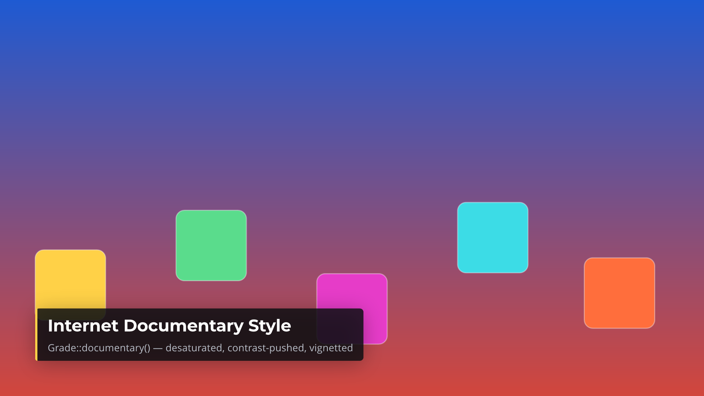 | 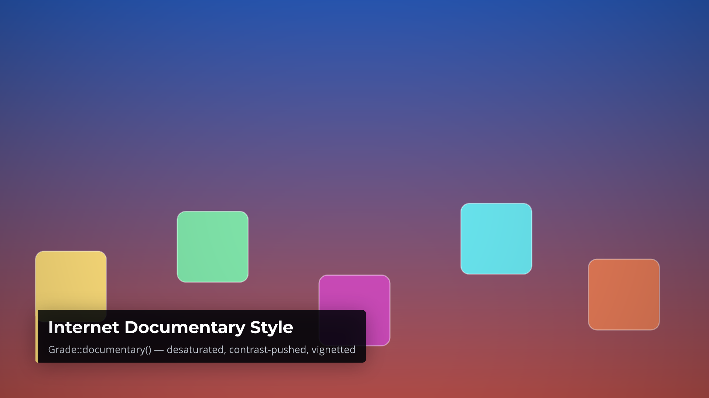 |

Produced by [`examples/grade_demo.rs`](examples/grade_demo.rs), which draws
its own colourful backdrop and renders the identical scene twice — nothing
else about the film changes between the two stills.

**Measured, not quoted: ~34-40ms a call at 1920×1080**
(`canvas::tests::apply_grade_cost_at_1080p`, release build), once per scene
per frame a grade is set on — real, but well under the ~170ms
`Presentation::CrossBlur` above costs, because a grade is one pass with no
second buffer (each pixel's output depends only on itself and, for the
vignette, its own position) where a box blur needs several. Against the
whole example film's own 12ms/frame average, a graded scene costs on the
order of 3-4× its own draw time on top. `Grade::default()` — every film's
default, since grading is opt-in — short-circuits before touching a pixel,
so a film with no grade set pays nothing for the feature existing.

## Look before you render

Rendering a film to judge its timing is the slow way round.

| | answers | on the example film |
|---|---|---|
| `showreel still --at 4.2s` | what does this moment look like? | ~100 ms |
| `showreel sheet --every 1.5s` | is the pacing right? | 3 s for all 35 seconds |
| `showreel preview --scale 0.35` | does the motion work? | 6.6 s |
| `showreel render` | the delivery | 25 s |

`sheet` puts the whole film on one page, labelled with timecodes and scene
names. It renders from a genuinely scaled-down film — type, padding, corner
radii and decode sizes all come down with the frame — so a thumbnail looks like
the film rather than the film with 1080p text pasted on it.


## GIF export

`showreel render` delivers an mp4 and its mobile cut. For a README or a web
page you often want a **GIF** instead — a soundless, self-playing loop that
needs no video tag. `showreel gif` produces one:

```bash
showreel gif film.jsonc --from 2s --to 5s -o clip.gif
```

It is a subcommand rather than a flag on `render` because a good GIF is a
different job with its own knobs: a **window** of the film (never the whole of
a long one — a sixty-second GIF is both enormous and useless, so `--from`/`--to`
are the point, in the film's own seconds), a smaller **width** for a page, and
a lower **frame rate**. The frames come off the exact same renderer `render`
uses — this is one more `FrameSink` (`src/encode.rs`), not a second render
path.

**The palette is the whole quality story.** GIF is a 256-colour format, so a
naive conversion banks every gradient and shimmers as it loops. `showreel gif`
generates the palette **from the actual footage** — ffmpeg's `palettegen`
sees these frames and picks the 256 colours that fit them, then `paletteuse`
quantises against that — in one filtergraph, with a Lanczos downscale to the
target width. It defaults to **ordered (Bayer) dithering**, not error
diffusion, because a GIF loops: ordered dithering is a fixed function of pixel
position, so a static background holds still instead of crawling. The grade
before/after in the gallery above — a full-frame gradient, the hardest case —
carries no visible banding because of this.

| flag | default | |
|---|---|---|
| `--from` / `--to` | whole film | the window, in the film's own seconds |
| `--width` | 480 | output width; height follows the aspect ratio |
| `--fps` | 15 | a GIF is not video — keep it low |
| `--dither` | `bayer` | `bayer` (stable in a loop), `sierra2` (smoother, but shimmers), `none` |
| `--palette` | `full` | `full` (whole frame) or `diff` (bias toward what moves) |
| `--colors` | 256 | cap the palette; fewer means smaller |

The command prints the finished file's size, because a GIF that's too big to
carry defeats its own purpose. The eight gallery clips above, at these
defaults (two of the full-frame-motion ones dropped to 128 colours after
checking by eye), run 77 KB–1.1 MB each.

## The studio

`showreel still`, `sheet` and `preview` answer "what does this look like" from
the terminal. `showreel studio` answers it in a browser, live, while you edit:

```bash
cargo run --release --features studio --bin showreel -- studio examples/kanto.film.jsonc -A <assets>
```

It starts a server on `localhost`, prints the URL, and gives you a scrubber
over the real timeline, best-effort play (labelled with the frame rate it's
actually achieving, not a promise of real time), the film's scene structure
and every layer, and live reload — edit the film file, save, and the browser
updates on its own. Parse and validation errors show in the page itself.

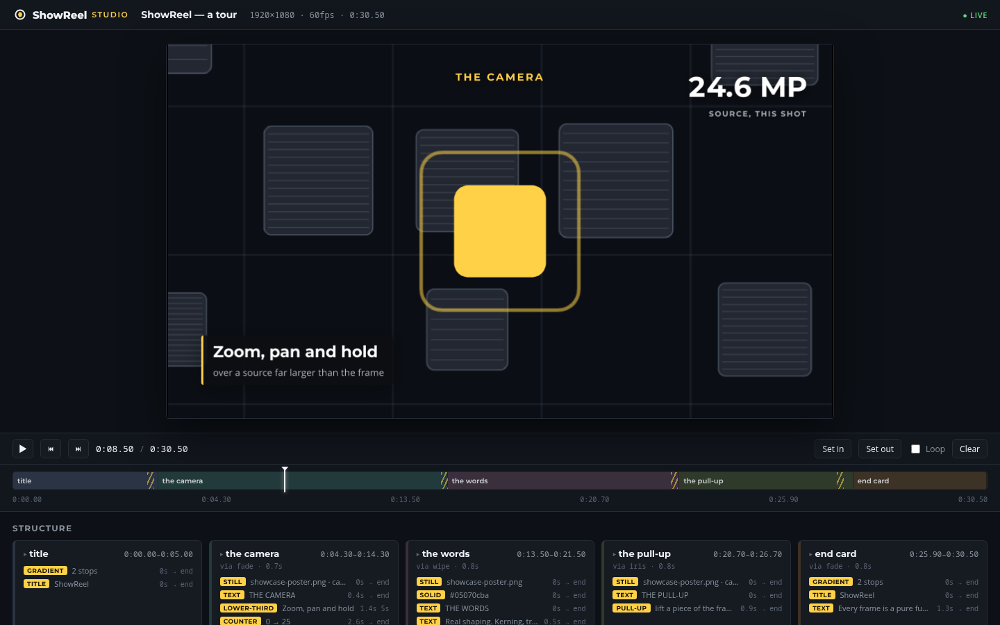

A film file with a mistake in it doesn't leave you looking at a blank page or
a terminal you've scrolled away from — the error is where you're already
looking, and the last frame that did render stays on screen:

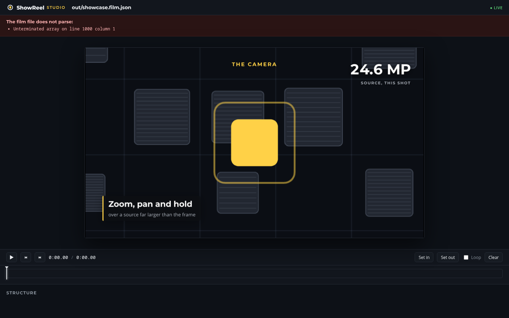

It's behind a `studio` feature — `cargo build`/`cargo run` without
`--features studio` never pulls in the web server, so the library and the
plain render path stay exactly as dependency-light as they were.

### API access

**"API access" could mean a documented, stable Rust library, or a local HTTP
service anything can call.** ShowReel already has the first — the library
this README is documenting, with a `prelude`, `AGENTS.md`'s "load-bearing
decisions" table pointing at the module that owns each one, and a test suite
that would break the moment a signature quietly changed underneath it.
Writing more prose about that isn't new capability. The HTTP surface is: it
lets a shell script, a browser tool, or anything in any language drive
ShowReel without shelling out to the CLI and scraping stdout — closer to what
"API access" usually means, and the reading this crate didn't already have.

**It rides the studio server rather than starting a second one.** `showreel
studio <film>` already runs a `tiny_http` server holding a live-reloaded,
validated `Film` and an `AssetStore` for it — everything `render`, `still`,
`info` and `check` need already exists there. A stateless render-farm-style
service (POST a film, get a video back) was considered and set aside: it
would mean a second code path for "load and validate a film" alongside the
studio's own, free to drift from it, for a capability the studio's own
snapshot already provides for free. So the endpoints below answer against
*the film the studio you started already has loaded* — point a studio at a
film, then drive it:

```bash
cargo run --release --features studio --bin showreel -- studio my.film.jsonc -A assets &

curl http://127.0.0.1:7878/api/info                    # title, duration, scenes, audio — JSON
curl http://127.0.0.1:7878/api/check                    # {"ok": true, "errors": []}
curl "http://127.0.0.1:7878/api/still?at=4.2" -o f.png   # a real frame, full declared size
curl -X POST "http://127.0.0.1:7878/api/render?mobile=1" -o out.mp4  # the actual encode
```

| endpoint | method | mirrors | notes |
|---|---|---|---|
| `/api/info` | GET | `showreel info` | JSON: title, `width`/`height`/`fps`, `duration`, `frameCount`, `scenes[]`, `audio[]` |
| `/api/check` | GET | `showreel check` | `{"ok": bool, "errors": [string]}` — a JSON parse failure counts as one error |
| `/api/still` | GET | `showreel still` | `?at=<seconds>`, full declared size (unlike `/api/frame`, which serves the studio's own `--scale` preview) — a PNG |
| `/api/render` | POST | `showreel render` | `?scale=`, `?crf=`, `?mobile=1` for the 720p delivery cut instead of the master — streams the finished mp4 back and deletes its own scratch file |

`/api/render` is the one endpoint worth pausing on: it runs the same
`Renderer` + ffmpeg pipeline the CLI does, so it costs the same time and CPU,
blocking the request until the file is ready, then reads the whole thing into
memory to send it — fine for the seconds-to-tens-of-seconds previews this
tool is built around, not designed for handing back a feature film.

**Localhost by default, and that's load-bearing, not a suggestion.** `/api/render`
runs ffmpeg and writes a file; reachable from a network, that is a remote
code/resource-exhaustion surface, not a convenience. `StudioOptions::host`
already defaults to `127.0.0.1` — the API rides that same default — and
`showreel studio --host 0.0.0.0` (for previewing on another device on your
own LAN) now also prints a startup warning naming exactly that risk, so
opening it is a decision you see, not one that happens quietly.

Proven, not just described: `tests/api_server.rs` starts a real server on a
real socket and drives all four endpoints (`/api/render` included, over an
actual TCP connection, skipped only when ffmpeg isn't on `PATH`) rather than
calling the JSON-building functions directly.

## MCP support

`showreel mcp` (needs `--features mcp`) runs an MCP server over stdio — five
tools an agent calls directly instead of shelling out to this CLI and
parsing its stdout:

| tool | mirrors | does |
|---|---|---|
| `new_film` | `showreel new` | writes a starter film (one title-card scene) to a path |
| `check_film` | `showreel check` | validates a film, returns `{ok, errors}` |
| `film_info` | `showreel info` | the film's structure — title, size/fps, duration, scenes, audio |
| `render_still` | `showreel still` | one frame, returned inline as a real PNG image |
| `render_film` | `showreel render` | the actual ffmpeg encode, master plus an optional mobile cut |

That is the same five-and-four the local HTTP API exposes (see "API
access" above), over a different transport for a different consumer: MCP
for an agent already in the same process tree, HTTP for anything reachable
over a socket. Both call the same library code (`Film::load`, `Renderer`,
`preview::still_at`, `Film::summary`) — there is one implementation of
"render a still," not three.

**"Build a film" is deliberately not five more tools mirroring every
`Content` variant.** A film is one JSON file — the browser editor's own
film object *is* that JSON (see `AGENTS.md`) — and an agent with ordinary
file tools already reads and writes it directly, faster than a round trip
through a tool call per layer. `new_film` scaffolds a starting point;
`check_film`/`film_info`/`render_still` are the fast feedback loop for
editing the JSON further, the same three things a person reaches for from
the terminal.

```bash
cargo build --release --features cli,mcp --bin showreel
./target/release/showreel mcp   # speaks JSON-RPC over stdin/stdout
```

Point an MCP-capable agent at that command (its config differs per host —
Claude Code's `.mcp.json`, for instance, wants `{"command": "...", "args":
["mcp"]}`). Built on [`rmcp`](https://crates.io/crates/rmcp), the official
Rust SDK, rather than a hand-rolled JSON-RPC framing — MCP's schema and
lifecycle messages are a moving target this crate has no business tracking
itself, the same reasoning that keeps ffmpeg invocation direct rather than
reimplemented. Behind its own feature flag for the same reason `studio` is:
it pulls in an async runtime (`tokio`) the plain render path has never
needed, so a default `cargo build` stays exactly as dependency-light as
before.

Proven over the real wire format, not just the tool functions in isolation:
`tests/mcp_server.rs` spawns the actual `showreel mcp` binary and speaks
real newline-delimited JSON-RPC to it over stdio pipes — every tool, a
missing-file error path, and a clean-shutdown check that would have caught
(and did, during development) a real bug: the server's async runtime
panicked on shutdown without `enable_time`, because `rmcp` uses a timer
internally that a minimal `tokio::runtime::Builder` doesn't enable by
default.

## In the browser

`showreel web-pack <film> -A <assets> -o dist` (needs `--features wasm`, and
`ffmpeg` once, ahead of time, to pre-decode any clips) turns a film into a
self-contained directory any static file host can serve — no server, no
plugin, just `tools/web/index.html` and the renderer compiled to
`wasm32-unknown-unknown`. It scrubs there exactly as `showreel studio` does
natively, and it **edits**: add a clip, set its trim, pick a transition, retype
a title, reorder scenes, and save the changed film back out as JSON — the same
tree either way, per the tree.

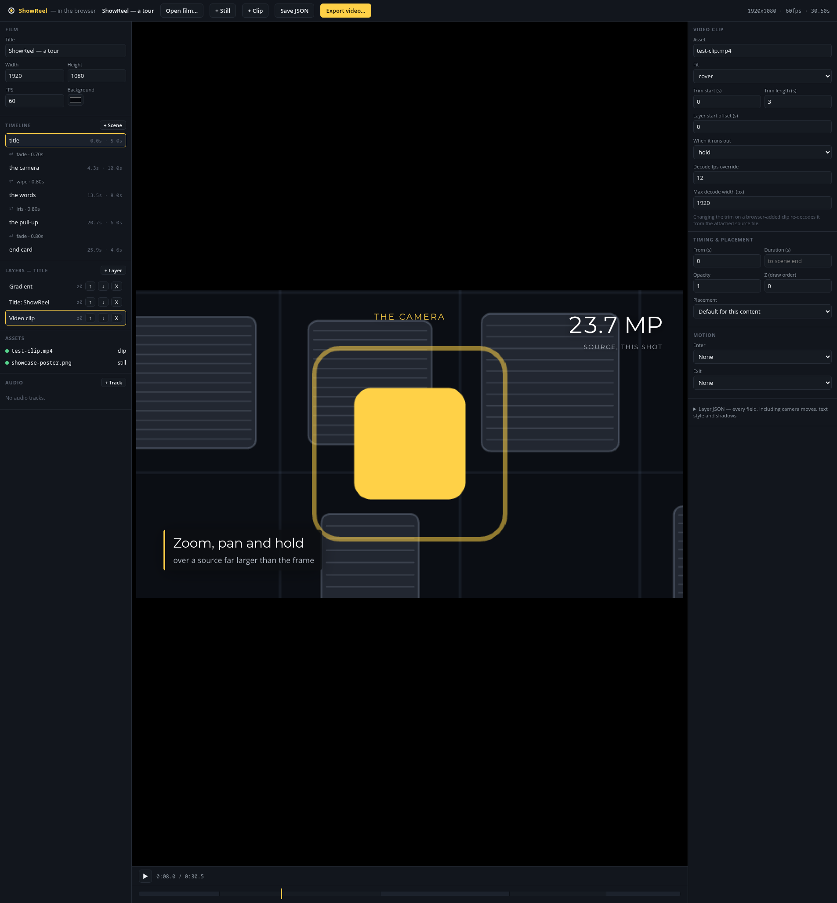

Dropping a video clip in decodes it there and then, in the tab, with no
ffmpeg — a seeked `<video>` element reaches the browser's own decoder, the
frames get packed into the same `.srclip` container `web-pack` already
produces natively, and the wasm build reads it back exactly as it would a
pre-packaged one. Editing has sound too: a real, independent Web Audio graph
plays film tracks and a clip's own soundtrack in sync with the preview — but
**exporting** a video is real `VideoEncoder` (WebCodecs) plus a hand-rolled
WebM muxer verified against `ffprobe`, and that exported file is video-only
today; the audio graph was not wired into it this round. See
[`AGENTS.md`](AGENTS.md) for that and the rest of what the browser build
cannot do yet (arbitrary-container demuxing, direct-manipulation of a
camera's own framing, no colour-grade widget) and
[the ffmpeg audit](docs/native-encode-audit.md) for why it still leans on
ffmpeg natively rather than a from-scratch encoder.

## Known limits

Named plainly, not buried in `AGENTS.md`'s longer sharp-edges list:

- **`Presentation::CrossBlur`** costs ~170ms a frame at 1080p, independent of
  its radius — fine for a sub-second transition, not for a film-length one.
- **A colour grade** costs ~34-40ms a frame at 1080p once set — see
  ["A colour grade"](#a-colour-grade) above.
- **An animated chart** adds ~9ms a frame at 1080p (a full gradient-stroked,
  filled function curve with axis labels) — see ["An animated
  chart"](#an-animated-chart) above. **Charts do not map data to audio** — the
  reference short does; that is a separate, deliberately un-started feature.
- **A clip's camera isn't mip-backed** the way a still's is — push in tight
  on footage and raise `max_width` to match, or it goes soft.
- **No rich text runs**: a `Text`/`Title`/`LowerThird` is one style for its
  whole string — no bolding or colouring a single word mid-line. Investigated
  and deliberately declined rather than half-landed; see `AGENTS.md`.
- **The browser build cannot decode video or mux audio on its own** — clips
  are pre-decoded natively (`showreel web-pack`, needs ffmpeg) or decoded
  client-side from a dropped file via `<video>`; a browser export is
  video-only, no audio track.
- **A camera's own framing has no direct-manipulation UI in the browser
  editor yet** — everything else (layer position, clip trim, callout
  target/label) drags on the preview; a camera move is still Advanced-JSON
  or Rust-only. Deliberately paused, not forgotten — see "Studies" below.
- **`/api/render` runs ffmpeg and writes a file for whoever can reach the
  port.** It defaults to `127.0.0.1` for exactly that reason; `--host
  0.0.0.0` prints a startup warning naming the risk rather than doing it
  quietly.

## Studies, and what drives the roadmap

Before a capability gets built, there's usually a study asking what the gap
actually is rather than guessing. Each one ends in a concrete verdict, not
just observations — `docs/anarchist-study.md`'s technique-by-technique
ranking is what identified the colour grade above as the one real capability
gap in that editing style (and named the parallax shot, built the round
before, as the other one). Reading a study before adding a feature it covers
is worth doing rather than skipping.

- [The Internet Anarchist study](docs/anarchist-study.md) — the "display
  style" the captain named directly: what's already covered by the camera,
  motion and callout primitives, and what genuinely wasn't (this session's
  colour grade, and the parallax shot before it)
- [The YouCut study](docs/youcut-study.md) — why a competing editor "feels
  obvious": recognition over recall, direct manipulation, one-tool-one-screen
  — the browser editor redesign this drove is deliberately paused, not
  abandoned
- [The Remotion study](docs/remotion-study.md) — what their API gets right,
  what it gets wrong, and why ShowReel is a data tree rather than a macro DSL
- [The TV Junkie study](docs/tvjunkie-study.md) — a captain-named video with a
  running "bankroll" counter and a split-screen kinetic-caption device used
  twice: both already authorable, and the one confirmed gap is small
  (per-layer rotation, for a diagonal stamp graphic)
- [Does ShowReel need ffmpeg at all?](docs/native-encode-audit.md) — encode,
  mux, decode and audio mixing scored separately, with real rav1e-vs-x264
  numbers
- [What a frame costs](docs/performance.md) — the measurements, and how the
  camera is fast

## Deeper

- [The example, in detail](examples/README.md) — the assets, and what the
  footage placements actually claim
- [Brand](docs/brand/README.md) — the mark, and how to regenerate it
- [`AGENTS.md`](AGENTS.md) — the sharp edges, for anyone working on it

## Licence

[PolyForm Noncommercial 1.0.0](LICENSE). Personal and noncommercial use is
free; commercial use needs permission first.
