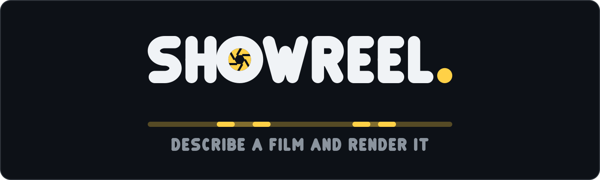

# ShowReel brand

**The final mark is [`showreel-logo.svg`](showreel-logo.svg), and its square icon lockup
is [`showreel-icon.svg`](showreel-icon.svg). These two files are the only ones to ship —
anywhere.**



The composition is the house one, shared with the sibling projects: one heavy geometric
wordmark, tight-tracked, white on a near-black panel; the motif **replacing one letter**;
a single accent-colour **full stop** closing the word; and the tagline underneath,
lighter, grey, wide-tracked.

What is this project's own is the **motif**, the **strip beneath it** and the **accent**.

* **The lens iris** stands where the O of SHOW would be. The letter is a ring already, so
  the substitution costs the word nothing — and what stands in its place is the capability
  the whole toolset was built around. ShowReel's headline feature is a camera that zooms,
  pans and holds over a source far larger than the frame
  ([`src/camera.rs`](../../src/camera.rs)), and `Iris` is a transition it actually ships
  ([`src/transition.rs`](../../src/transition.rs)). The aperture is not a stock camera
  pictogram borrowed to mean "video"; it is a thing in the code. Its blades are straight
  and hard-edged against an alphabet of round terminals, so it reads as a mechanism
  standing in a line of letters rather than as another glyph.
* **The timeline** under the wordmark is where AsciiWorldEngine puts its skyline: scenes
  as blocks, and between them the short bright overlap where a transition runs and both
  scenes are on screen at once. That overlap is the arithmetic in `Timeline::placements` —
  a 4s scene, a 1s transition and a 4s scene make a **7** second film, not 9 — drawn at a
  glance. The blocks alternate in weight so abutting scenes read as separate blocks
  instead of merging into one bar.
* **The accent is the film's own colour.** `#ffd147` is `Theme::accent` out of
  [`src/theme.rs`](../../src/theme.rs): the amber that draws every lower-third bar, every
  callout ring and leader line, and every pull-up border in a ShowReel film. Look at any
  still from the example reel and it is the only colour in the frame, so the mark and the
  product agree rather than merely coexist.

The blades are drawn **fill, then knock the opening out, then cut the seams**, because
that is how a diaphragm actually reads. Building the iris out of triangles instead — the
first attempt — produces a pinwheel of spikes that looks like a star. Do not reintroduce
it.

Everything here is **hand-authored**: the letterforms are original stroked skeleton paths
drawn in [`generate.py`](generate.py); **no font is embedded, subset or traced**, so there
is no third-party licence in any of these files. The alphabet is the sibling marks'
alphabet unchanged, which is what makes the wordmarks visibly the same family; `F` is new
here and is drawn to the same rules (it is `E` without the foot).

Regenerate deterministically with `python3 docs/brand/generate.py` — **edit the generator,
never the SVGs by hand** — and re-render the previews in the same commit:

```bash
cd docs/brand
magick showreel-logo.svg preview/logo.png
magick showreel-icon.svg preview/icon-128.png
magick -background none showreel-icon.svg -resize 16x16 preview/icon-16.png
```

Every SVG paints its own panel with a faint border, so it survives GitHub light mode, dark
mode and a pure-black page; nothing is theme-conditional.

## Tagline

> **DESCRIBE A FILM AND RENDER IT**

The shortest honest description of the project, and its actual thesis: a film here is a
description you write, not a timeline you drag things around on.

## The icon is drawn bolder than the wordmark, on purpose

The wordmark's iris has a fine opening and thin seams, which is right at hero size and
collapses to a blob at favicon size. The icon therefore uses a heavier ring (14 of 128),
a larger opening (38 across) and thicker seams, so that at 16 px it is still a ring with a
dark centre rather than an amber dot. [`preview/icon-16.png`](preview/icon-16.png) is the
real test, not a resized illustration.

## Files

- [`showreel-logo.svg`](showreel-logo.svg) — **the** wordmark lockup, 1400×420
- [`showreel-icon.svg`](showreel-icon.svg) — **the** square icon lockup, 128×128
- [`preview/logo.png`](preview/logo.png), [`preview/icon-128.png`](preview/icon-128.png),
  [`preview/icon-16.png`](preview/icon-16.png) — rendered previews at hero, avatar and
  favicon size
- [`generate.py`](generate.py) — the only source of truth; edit it, never the SVGs by hand
