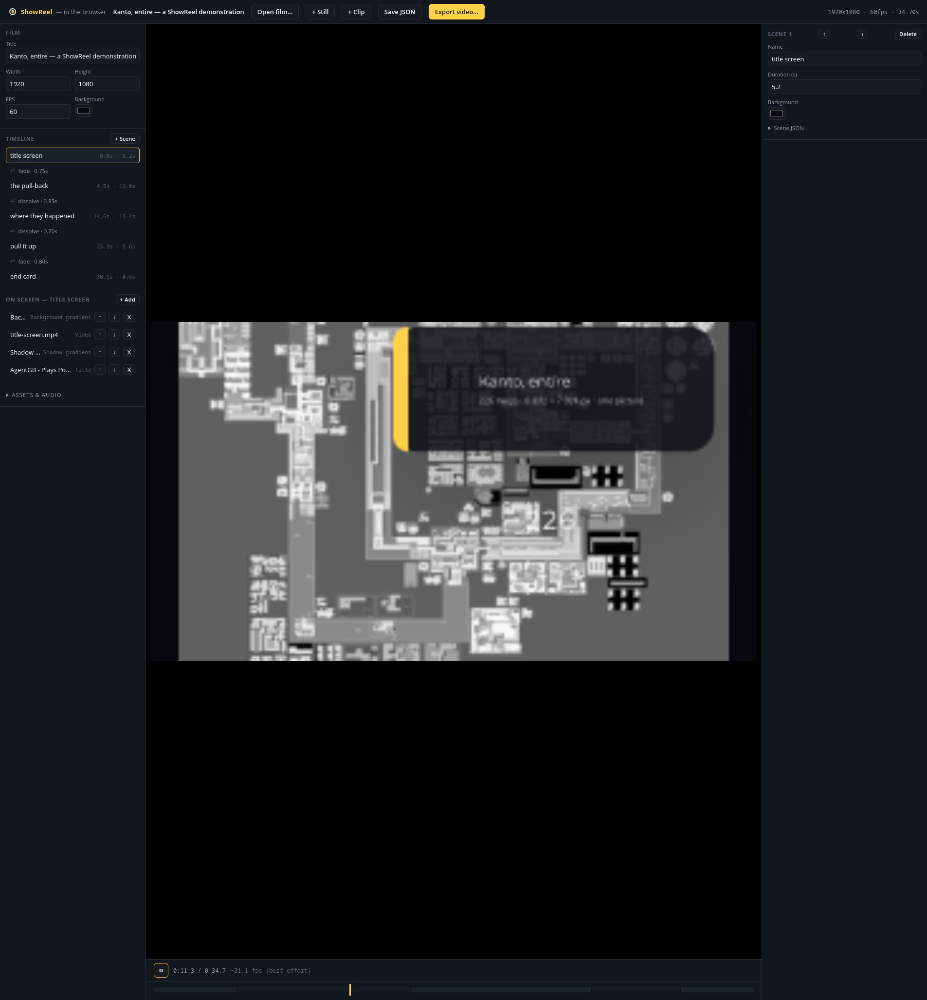
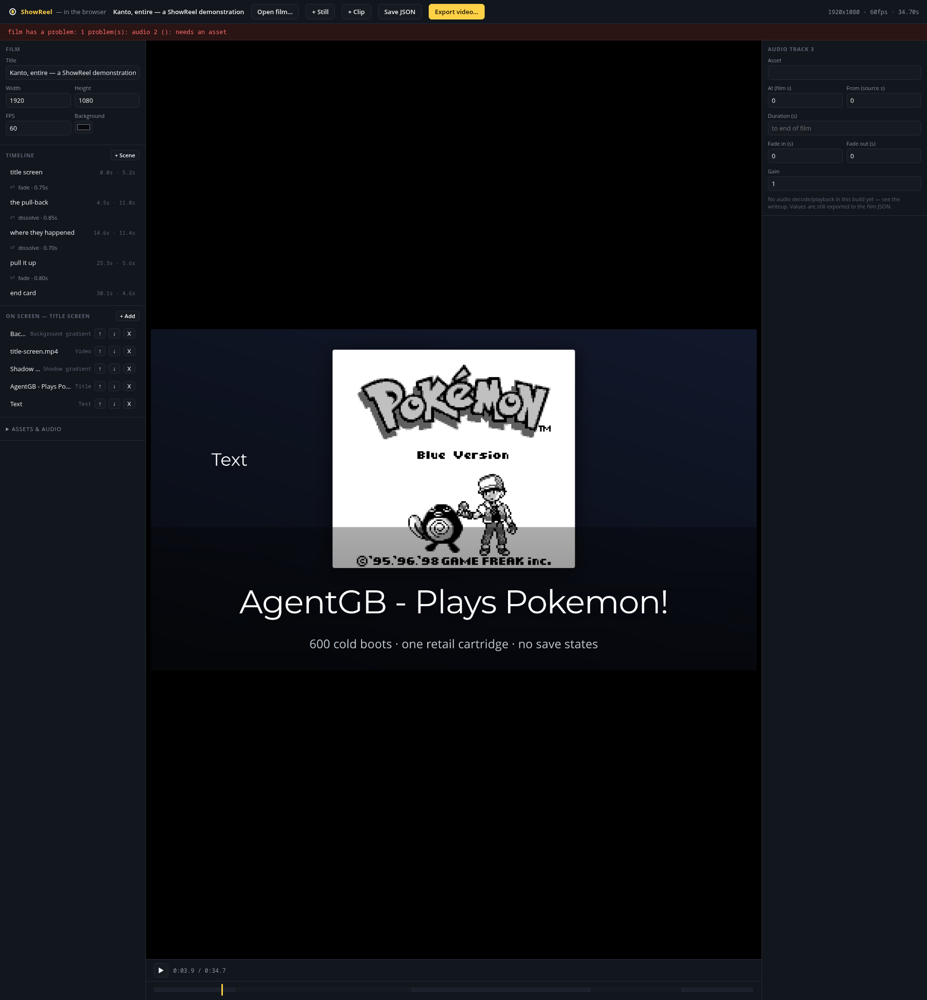
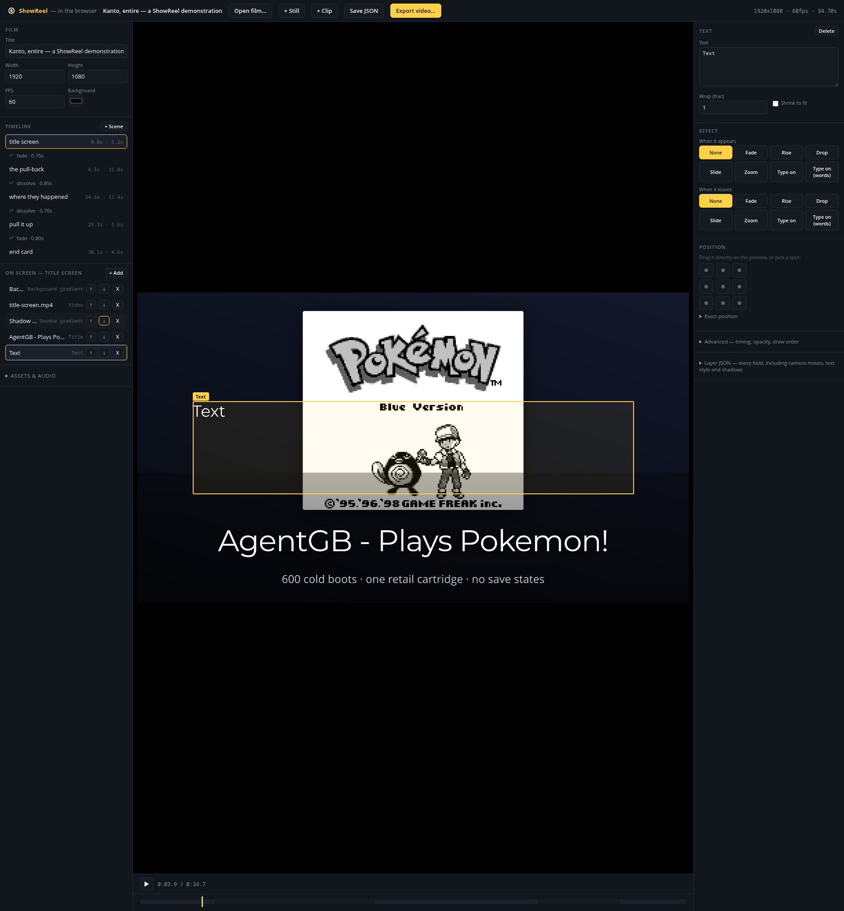

# YouCut, studied properly — and what our own editor still gets wrong

The redesign brief named YouCut as the standard for "clean, minimal, obvious" and the
crew applied sensible principles in its name. Nobody had actually sat down and worked
out what YouCut *does* that produces that reputation. This is that pass, plus an honest
re-read of `docs/remotion-study.md` against the browser editor we've since built, plus a
hands-on audit of our own editor at `http://localhost:8099` (backed by `tools/web/`).

## What this is based on, and what it is not

**I did not drive YouCut.** This sandbox has no Android/iOS runtime and no app-store
access, and installing one was out of scope for a study. Everything below about YouCut
is drawn from its public reputation, screenshots and video walkthroughs commonly
associated with it, and app-store review language describing it — general knowledge of
the app and its category, not a session at the controls. Where I say "YouCut does X," read
it as *the consistent, widely-reported account of X*, not a first-hand observation.

**I did drive our own editor.** Every claim about ShowReel's browser editor below was
produced by opening `http://localhost:8099`, clicking through it, and reading the
`tools/web/` source that renders what I clicked — screenshots and file:line citations are
included so the next crew can check them rather than take my word.

## YouCut as a design, not a feature list

The reputation is "obvious." The mechanism behind that reputation, as best it can be
reconstructed without driving the app:

**The subject is never optional chrome.** The app opens straight onto your device's own
video/photo grid — not a blank canvas, not a template gallery, not a dashboard. The first
decision it asks you to make is "which footage," because a video editor with no footage
loaded is not yet doing anything. Once picked, the preview occupies the top of the screen
at all times, full-width, and everything else is arranged *below* it. The thing being
edited is always the biggest, topmost, most stable element on screen; the tools that edit
it are a strip you reach for underneath.

**The timeline is a filmstrip, not a list.** Clips are represented as a row of actual
decoded thumbnail frames, not names. You recognize a clip by what's in it, the same way
you'd recognize a photo in a camera roll — you never read a filename to figure out which
clip is which.

**One tool, one job, one screen.** Tapping an icon in the tool row (commonly: Cut, Speed,
Volume, Filter, Effects, Text, Sticker, Music, Voiceover, Ratio) replaces the tool row with
*only* the controls for that tool. It does not open a form with every property of the
clip; it opens a focused, modal surface for exactly one kind of edit, with a clear way
back out. This is the opposite of a property inspector — you are never looking at fields
you didn't ask for.

**Trim is direct manipulation on the filmstrip itself**, not a numeric range: you drag the
ends of a clip's own thumbnail strip and see the frames change under your finger. Add
text is: tap Text, type, then drag the text box on the *preview* to where you want it —
positioning is always a drag against the actual frame, never coordinates. Add music is a
tap into a curated, licensed, in-app stock library (browsable, previewable, searchable)
with your own device files as a fallback tab, not a starting point.

**Vocabulary is plain and task-shaped.** Cut, Speed, Volume, Filter, Music, Text, Ratio —
never "presentation," "placement," "keyframe," "anchor." Nothing is named after its data
representation.

**What it refuses to show, by design:** no timeline zoom controls to fight with, no
numeric x/y for position (dragging is the only way in, for the common case), no raw
project file, no modal that shows two unrelated concerns (e.g. trim and text style) at
once. The refusal is the point — every screen answers one question.

That composite — footage-first layout, thumbnails everywhere, one-tool-one-screen, drag
instead of type, plain nouns — is almost certainly *why* people call it obvious. It isn't
one clever feature; it's that recognition (thumbnails, direct manipulation) is preferred
over recall (names, numbers, menus) at every single decision point.

## Re-reading `docs/remotion-study.md` against what we built

The original study's table has one row worth revisiting now that the browser editor
exists:

> **A scrubbable Player** | Not matched; approached from the other side — stills in
> ~100 ms, a labelled contact sheet of the whole film in ~3 s, and a genuinely scaled-down
> pass | `preview.rs`, `scale.rs`

That verdict is out of date. `tools/web/` plus `src/wasm.rs` plus `src/studio.rs` have
since built the actual thing: a scrubbable, hot-reloading, drag-and-drop timeline in a
browser, no render required to see a change. Measured fps at various build flags is in
`AGENTS.md`'s sharp edges (up to ~67fps at half-resolution preview with both `+simd128`
and `opt-level 3`). This is a real win over the original assessment — worth updating the
study's own table, not just noting here:

| Idea | Verdict (2026-08 update) | Where it lives |
|---|---|---|
| A scrubbable Player | **Matched, and then some** — the browser editor scrubs, hot-reloads on file change, and lets you edit while scrubbing; Remotion's `<Player>` only plays | `tools/web/`, `src/wasm.rs`, `src/studio.rs` |

But the comparison is not simply "we won." Remotion's `<Player>` is deliberately a
*component*: an embeddable playback engine with an imperative ref
(`play()`/`pause()`/`seekTo(frame)`/`getCurrentFrame()`/`isPlaying()`) and events
(`frameupdate`, `seeked`, `timeupdate`, `ended`) that some *other* app wires into its own
UI. Remotion Studio — the actual scrubbable editor with a timeline and a props panel — is
a separate, optional layer built on top of that component.

**We never built the separable half.** `tools/web/main.js`'s playback loop
(`tick()`, `main.js:341`) and `src/wasm.rs`'s `sr_render_at`/`sr_set_draft_scale` are
called directly by the one editor page; there is no standalone "just play this film"
widget with its own small API that a different page could embed without dragging in the
whole edit-everything chrome (the inspector, the add-layer menu, the JSON editing). If a
future need shows up — embedding a finished film in a landing page, or handing a client a
review-only viewer they can scrub but not edit — that would need extracting from
`tools/web/` by hand today; it isn't a reusable module. Worth naming as the one thing
Remotion's Player still has that we don't: a deliberate seam between *playback* and
*editing chrome*.

## Driving our own editor: what actually happens

Loaded `http://localhost:8099` (serving `/home/aaron/showreel-web`, built from
`tools/web/`), with the Kanto demonstration film. Screenshots taken this session; file:line
citations point at the code that produced each behaviour.

### At rest

Three columns: film/timeline/layers (left, all text rows), preview (centre), inspector
(right, empty until something is selected — "Select a scene, layer, transition or audio
track to edit it"). Every row in the left column — scenes, layers, assets, audio tracks —
is a plain text label. **There are no thumbnails anywhere in the editor** — confirmed by
reading `tools/web/editor.js` and `main.js` end to end: no ``, no
`background-image`, no `canvas.toBlob`, no decoded-frame preview is ever attached to a
row. A scene is a name and two numbers; an asset is a name and a plain coloured dot; a
clip layer is a filename and a content-kind label. Recognizing "which clip is which"
means reading text, every time — the exact opposite of YouCut's filmstrip.

### The four things the redesign fixed — confirmed present

Selecting a clip layer (`title-screen.mp4`) shows Asset, Fit, a **draggable Trim** bar
(`tools/web/editor.js:299`'s doc comment: "a draggable trim bar in place of two 'type the
seconds' boxes"), then an **Effect** section with named presets (Fade/Rise/Drop/Slide/
Zoom/Type on/Type on (words)) for both entrance and exit, then Advanced/Layer JSON folded
away. Adding a Text layer and selecting it shows a **Position** section: a 9-dot grid
*and* "drag it directly on the preview" — real direct manipulation, backed by
`tools/web/geometry.js`'s hand-rolled mirror of `Placement::resolve`. Trim, effects, and
moving text are all real, and reasonably close to YouCut's own directness for those three
specific actions. This matches what `AGENTS.md` already claims about the redesign, and it
held up under actual use.

### The fifth thing: recognition vs recall, structurally absent

Point above, restated as the ranked finding: **no visual recognition anywhere.** YouCut's
obviousness rests on never making you read a name to know what something is. Our editor
makes you read a name for *everything* — every scene, every layer, every asset, every
audio track. Adding thumbnails to the scene list, the clip/still layer rows, and the asset
list would be the single highest-leverage change toward the "obvious" reputation the
captain is benchmarking against, because it's the actual mechanism behind that
reputation, not incidental to it.

### The sixth thing: the stage doesn't fill the stage

At 1920×1080, playing back, the actual rendered frame occupies roughly the bottom half of
the centre pane — there is a large, empty black region above it that is not letterboxing
(it isn't centered) and does not track the film's aspect ratio. The available preview real
estate is not being used; a person's eye is drawn to a mostly-empty pane with the actual
content low and small. Fixing this is layout work in `tools/web/index.html`'s
`#stage-overlay`/CSS, not a rendering change.

### The seventh: adding media is typing a filename from memory, not picking one

Selected "+ Track" under Assets & Audio to add a music track. The **Asset** field is a
bare `<input type="text">` (`fText`, `tools/web/editor.js:276`, used identically at
`editor.js:678` for audio and `editor.js:440`/`445` for video/still layers) — there is no
dropdown, no autocomplete, no datalist, even though the editor already enumerates every
asset in use two panes over (`renderAssetRows`, `editor.js:598`). You must know and type
the exact filename by hand for *any* asset reference, not just audio. This is close to
the opposite of YouCut's tap-a-thumbnail-from-a-library flow, and it's an easy, contained
fix: wire the already-known asset list into a `<datalist>` on these fields.

Also visible in this flow, unprompted: adding a blank audio track immediately produced a
top-of-page validation banner — **"film has a problem: 1 problem(s): audio 2 (): needs an
asset"** — live validation is a genuine strength (catches the mistake before you forget
about it), but the copy itself has two small tells of being unpolished: the doubled
plural "1 problem(s)" and the empty parenthetical `audio 2 ()` where an asset name should
render. Separately, an existing audio track in the loaded film displayed its duration as
literally **"undefineds"** (`${a.at}s` template with `a.at` unset renders the string
"undefined" concatenated with "s" — `editor.js:565`, though note this reads `a.at`, the
placement time, not duration; either way an unset numeric field prints as `undefineds`
rather than a blank or a placeholder). None of these are functional bugs, but they're
exactly the kind of paper cut that undermines "clean and obvious" one small surprise at a
time, and they're now reproduced and cited rather than guessed at.

### The eighth: default text placement collides with what's already there

Adding a Text layer to a scene that already has a full-frame clip playing put the new
text box dead centre, overlapping the clip's own artwork. This isn't a bug — it's
`Content::default_placement` (`src/layer.rs:508`) working exactly as designed: Text/Title
default to `Placement::Anchored { anchor: Centre, .. }`, with no awareness of what else is
already on screen. YouCut's default text placement (typically centred, sometimes
bottom-safe) has the same "no collision awareness" property in principle, but its preview
is always live and the text is immediately draggable with visible handles the instant it
appears, so the collision is obvious and a one-drag fix. Ours has the drag too
(confirmed above) — the gap is smaller than it first looks, but the *first frame* a user
sees after adding text is a worse one than YouCut's, because ours has no bias toward an
empty region of the frame and YouCut's typically does.

### One structural inconsistency worth naming

Layers get inline reorder controls (↑ ↓ ✕) directly in their row in the left column.
Scenes do not — reordering a scene requires selecting it first, then using ↑/↓ buttons
that only appear in the right-hand inspector (`tools/web/editor.js:621`,
`scene-up`/`scene-down`, versus the layer row's own buttons rendered inline). Two
structurally similar "move this thing in a list" actions, two different numbers of steps,
for no apparent reason.

## Recommendations, ranked

Split as asked — interface (how it feels) versus capability (what it can render) — because
the captain has been treating them as separate workstreams.

### Interface

1. **Thumbnails in the scene list, layer rows, and asset list.** This is the single
   highest-leverage change: it is the actual mechanism behind "obvious," not a
   nice-to-have alongside it. Even a cheap version — decode one frame per clip/still at
   add-time and cache it as a data URL, cost paid once, not per render — would close most
   of the recognition gap with YouCut. Scenes could composite that same cached still.
2. **Fit the stage to the available preview pane.** The rendered frame should fill the
   centre pane (respecting aspect ratio) rather than sitting inside a much taller mostly-
   empty box. Layout-only, no wasm change.
3. **Wire the known asset list into a `<datalist>` on every asset-reference field**
   (video/still layer, audio track). Removes a whole class of "typo'd a filename, got a
   validation error" failures and is most of the way to feeling like picking rather than
   typing.
4. **Give scenes the same inline reorder affordance layers already have.** Small,
   consistency-only fix.
5. **Fix the copy paper cuts** — "1 problem(s)" pluralization, the empty
   `audio 2 ()` parenthetical, and the `undefineds` render for an unset numeric field
   (render nothing, or an explicit placeholder, when a bound value is `undefined`/`null`
   rather than string-concatenating it).
6. **Bias a freshly added Text/Title's default placement away from dead centre** when the
   scene already has full-frame content — even a simple "prefer bottom-third if the frame
   isn't empty" heuristic would remove the worst-case first impression, without touching
   `Content::default_placement`'s existing centred default for the common empty-frame
   case.

### Capability

1. **Audio playback in the browser editor.** This is the largest gap between what the
   crate can already do (a whole tested audio pipeline — gain, fades, mixing, per-clip
   soundtracks) and what a person editing in the browser actually experiences: total
   silence. You add a music track, set its gain and fades, and cannot hear any of it until
   a full native ffmpeg render. For an editor whose whole pitch is a fast, scrubbable
   preview loop, silence during scrubbing is a bigger day-to-day miss than any single
   missing text effect. `AGENTS.md` already documents this honestly as a known gap; it
   should move up the list, not stay parked.
2. **An asset library/picker, not just the datalist above** — a way to add a *new* asset
   (upload, or point at an existing project asset) from inside the audio/media add flow,
   rather than needing to already know a film references it. Smaller than #1, but the
   other half of closing the "type a filename from memory" gap.
3. **Direct manipulation for camera framing** (drag to reframe, scrub keyframes) — already
   named as a known gap in `AGENTS.md`. It's the one major on-canvas edit still
   Advanced-JSON-only after the redesign, and the redesign's own instinct (make it a drag,
   not a form) applies just as well here as it did to position and trim.
4. **Rich text runs — still correctly declined, for now.** Re-reading the "Considered, not
   built" section against tonight's actual additions (clip audio, cross-blur dissolve, a
   progress bar, clip speed, `showreel new`): none of tonight's work touches the
   four-subsystem seam (`PositionedGlyph`/`TextLayout::build`/`wrap`/`text::draw`) that
   made rich text runs expensive, so nothing has changed the cost side of that call. What
   *has* changed is the opportunity cost: #1 and #3 above are both cheaper and more
   load-bearing for "does this feel obvious and finished" than bolding one word in a
   title. The decision to decline holds up; the ordering behind it is now explicit.

## Answering "we still going with features?"

Given what tonight added — clip audio, cross-blur dissolve, a progress bar, clip speed,
`showreel new` — the crate's *rendering* feature set is in good shape; the thin edges left
are mostly at the boundary between the engine and the browser editor, not missing render
capability:

- **Audio is the thinnest thing that's actually load-bearing right now** — not because the
  audio pipeline itself is weak (it's well-tested, per `AGENTS.md`'s audio section), but
  because the one place a person actually interacts with a film day-to-day (the browser
  editor) cannot play any of it back. That's the next capability work, ahead of any new
  render feature.
- Camera direct manipulation is the other real capability-shaped gap, and it's already
  named as such.
- Rich text runs remains correctly out of scope — see above.
- Everything else raised in this study (thumbnails, stage sizing, asset pickers, copy
  paper cuts, scene reorder) is interface work, not new capability, and is cheaper than
  any of the capability items above.

If forced to pick the single next thing: **browser audio playback**, because it's the
largest gap between what the engine can already do and what the flagship editing
experience lets a person perceive while they work — which is exactly the kind of gap this
study's whole YouCut comparison was about.
